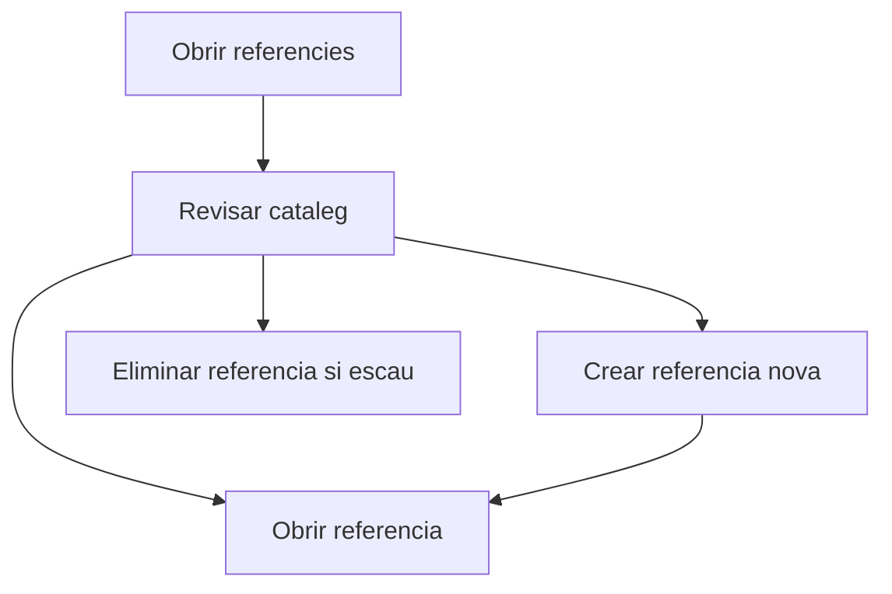

# Referencies de venda

## Per a que serveix aquesta pantalla

La pantalla de referencies de venda permet consultar i mantenir el cataleg de referencies comercials utilitzades al modul de vendes. Des d'aqui pots crear noves referencies, obrir-les per editar-les i eliminar-les si no tenen dependencias que ho impedeixin.

## Accions disponibles

- Crear una referencia nova.
- Obrir una referencia existent.
- Eliminar una referencia.
- Consultar el cataleg carregat per al modul de vendes.

## Flux habitual

1. Revisa la llista de referencies disponibles.
2. Obre la referencia que vols modificar o prem el boto de crear per donar-ne d'alta una de nova.
3. Si una referencia ja no s'ha de fer servir, intenta eliminar-la des de la llista.

## Aspectes importants

- Aquesta pantalla treballa sobre el repositori compartit de referencies, filtrat pel modul `sales`.
- Una referencia pot estar relacionada amb altres processos, especialment si ja s'ha utilitzat en pressupostos, comandes o rutes de fabricacio.
- El sistema obre la fitxa de detall amb una URL nova quan crees una referencia.

## Errors frequents

- Si no es pot eliminar una referencia, normalment es perque esta relacionada amb altres registres del sistema.
- Si la llista no mostra el que esperes, comprova que la referencia pertanyi realment al modul de vendes.
- Si la creacio o l'edicio no es reflecteixen a la llista, torna a entrar a la pantalla o recarrega les dades.

## Proces basic

