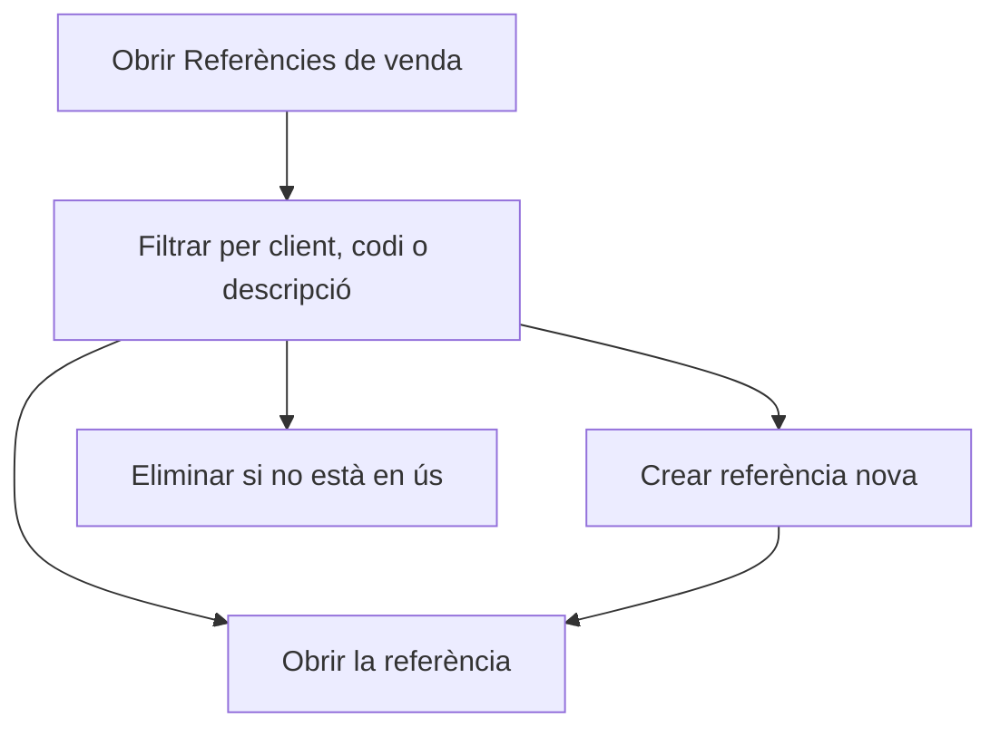

# Referències de venda

## Per a que serveix aquesta pantalla

És el catàleg de referències que es venen: les peces o serveis que apareixen a les línies de pressupostos, comandes, albarans i factures. Des d'aquí en cerques una, en consultes els adjunts i en crees de noves. La fitxa de cada referència permet, a més, definir-ne les rutes de fabricació.

## Accions disponibles

- Filtrar per «Client», «Data creació», «Codi» i «Descripció»; la llista es filtra mentre canvies els filtres.
- Netejar tots els filtres amb «Netejar».
- Crear una referència amb el botó «+» («Crear nou»): s'obre una fitxa buida.
- Obrir una referència fent clic a la fila.
- Consultar els documents adjunts de la referència amb la icona del clip («Adjunts»).
- Eliminar una referència amb la icona de paperera («Eliminar»), després de confirmar-ho.
- Adaptar les columnes i desar vistes amb la icona d'engranatge («Configuració de la vista»).

## Flux habitual

1. Obre «Referències de venda».
2. Filtra pel «Client» o escriu part del «Codi» o de la «Descripció».
3. Revisa «Versió», «Preu» i «Cost» a la taula.
4. Fes clic a la fila per obrir-ne la fitxa, o prem «+» per donar d'alta una referència nova.
5. Si has de revisar plànols o documents, obre els adjunts amb el clip.

## Aspectes importants

- Només es mostren les referències marcades per a vendes. Les referències de compres i de producció es gestionen des dels seus mòduls.
- La columna «Cost» mostra el cost teòric de fabricació, calculat a partir de la ruta de fabricació de la referència.
- Una referència amb «Client» informat només apareix a les línies dels pressupostos d'aquest client. Les que no tenen client apareixen per a tots els clients.
- «Data creació» filtra per la data en què es va donar d'alta la referència.
- No es pot eliminar una referència que ja s'ha fet servir: el sistema ho bloqueja si té comandes, albarans de recepció, moviments de magatzem o una ruta de fabricació, o si forma part d'una llista de materials. Quan es pot eliminar, l'eliminació és definitiva.

## Errors frequents

- Si en eliminar surt «Referència amb dependències:» seguit d'una llista, la referència està en ús. Cada línia indica el motiu; per exemple, «Té una ruta de producció definida» vol dir que primer cal eliminar la ruta des de la fitxa de la referència.
- Si no trobes una referència, prem «Netejar»: pot quedar aplicat un filtre de client o de data.
- Si la referència existeix però no apareix aquí, pot ser que no estigui marcada per a vendes.

## Proces basic

```mermaid
flowchart TD
    A[Obrir Referències de venda] --> B[Filtrar per client, codi o descripció]
    B --> C[Obrir la referència]
    B --> D[Crear referència nova]
    D --> C
    B --> E[Eliminar si no està en ús]
```
