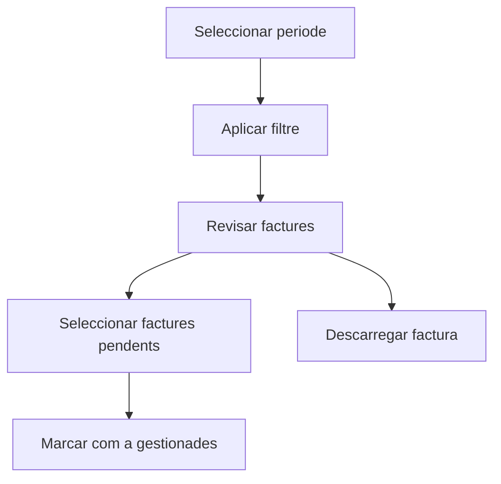

# Comptabilitzacio de factures de venda

## Per a que serveix aquesta pantalla

Aquesta pantalla permet consultar les factures de venda dins d'un periode, identificar quines ja estan gestionades i marcar en bloc les seleccionades com a gestionades.

## Accions disponibles

- Seleccionar un rang de dates per carregar les factures del periode.
- Incloure o excloure les factures que ja estan en estat Gestionada.
- Marcar diverses factures de la taula per comptabilitzar-les en bloc.
- Descarregar una factura individual des de la columna d'accions.
- Revisar client, estat, data, venciment i import base abans de gestionar-les.

## Flux habitual

1. Selecciona el periode que vols revisar.
2. Decideix si vols veure tambe les factures ja gestionades.
3. Prem el boto de filtre per carregar els resultats.
4. Revisa la taula i selecciona les factures pendents.
5. Prem el boto de confirmacio per marcar-les com a gestionades.
6. Si cal, descarrega una factura concreta per revisar-la.

## Errors frequents

- Si no es carreguen factures, comprova que hagis seleccionat un periode complet.
- Si no veus registres pendents, activa l'opcio de mostrar les gestionades per validar l'estat actual.
- Si el boto de comptabilitzar no s'activa, revisa que hi hagi almenys una factura seleccionada.
- Si una factura no es descarrega, torna-ho a provar i comprova que el document existeixi correctament al sistema.

## Proces basic

