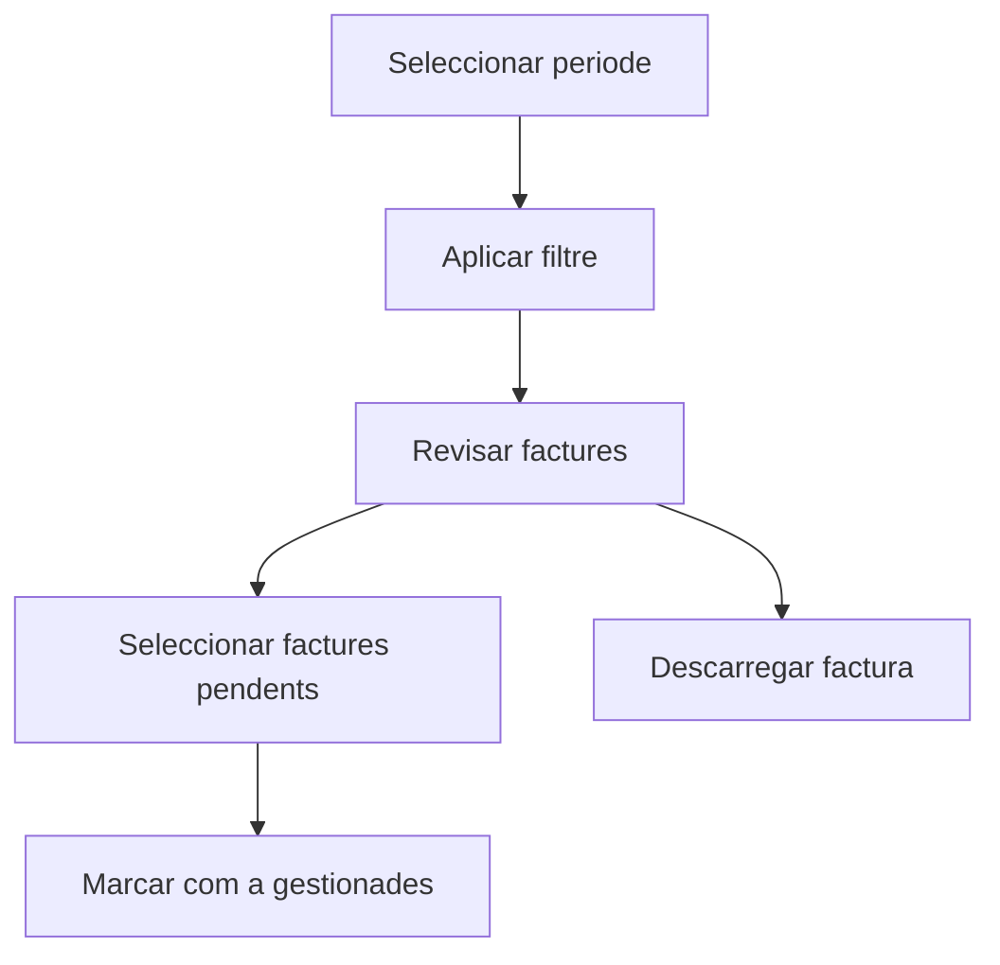

# Comptabilitzacio de factures de venda

## Per a que serveix aquesta pantalla

La pantalla de comptabilitzacio de factures de venda permet revisar factures dins d'un periode, identificar quines ja estan gestionades i marcar-ne diverses en bloc com a `Gestionada`. Es una pantalla de proces massiu, no la llista operativa habitual de factures.

## Accions disponibles

- Seleccionar un rang de dates.
- Incloure o excloure les factures que ja estan en estat `Gestionada`.
- Carregar les factures del periode indicat.
- Seleccionar diverses factures de la taula.
- Marcar en bloc les factures seleccionades com a gestionades.
- Descarregar una factura individual per revisar-la.

## Flux habitual

1. Selecciona el periode que vols revisar.
2. Decideix si vols incloure tambe les factures ja gestionades.
3. Prem el boto de filtre per carregar els resultats.
4. Revisa la taula i selecciona les factures pendents.
5. Executa l'accio de marcar-les com a gestionades.
6. Si cal, descarrega una factura concreta abans de confirmar el canvi.

## Aspectes importants

- Aquesta pantalla no substitueix la llista de `Factures de venda`; esta pensada per gestionar canvis massius d'estat dins d'un periode.
- L'estat `Gestionada` s'utilitza per distingir factures que ja han passat pel proces administratiu o comptable previst.
- La seleccio multiple es clau: si no hi ha cap factura seleccionada, l'accio massiva no es pot executar.
- Mostrar o ocultar factures ja gestionades canvia molt la lectura de la taula, especialment en periodes ja tancats.

## Errors frequents

- Si no es carreguen factures, comprova que hagis seleccionat un periode complet.
- Si no veus registres pendents, activa l'opcio de mostrar les gestionades per validar l'estat actual.
- Si el boto de comptabilitzar no s'activa, revisa que hi hagi almenys una factura seleccionada.
- Si una factura no es descarrega, torna-ho a provar i comprova que el document existeixi correctament al sistema.

## Proces basic

