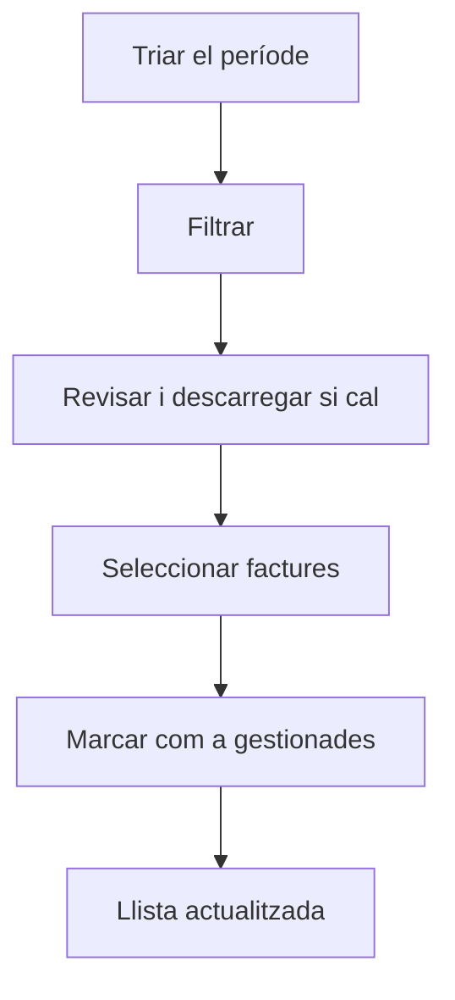

# Comptabilització de factures de venda

## Per a que serveix aquesta pantalla

Serveix per tancar administrativament les factures de venda d'un període: les llistes, les revises i en marques moltes alhora com a gestionades, per exemple quan ja s'han passat a la comptabilitat. No substitueix «Factures de venda»: aquí no es creen ni s'editen factures.

## Accions disponibles

- Triar el «Període» al calendari (data d'inici i de fi) i prémer «Filtrar».
- Marcar «Gestionades» per incloure també les factures que ja estan gestionades.
- Restablir amb «Netejar»: buida el període, desmarca «Gestionades» i buida la llista.
- Seleccionar factures amb les caselles de la primera columna.
- Marcar les factures seleccionades com a gestionades amb el botó verd de la marca («Marcar com a gestionades»).
- Descarregar una factura en Word amb la icona de descàrrega de la seva fila («Descarregar factura»).

La taula mostra el «Número», el «Client», l'«Estat», la «Data», el «Venciment» (l'últim venciment) i l'«Import base».

## Flux habitual

1. Obre «Comptabilització de factures de venda». La llista surt buida.
2. Tria el període, per exemple el mes que vols tancar, i prem «Filtrar».
3. Revisa les factures pendents i, si cal, descarrega'n alguna per comprovar-la.
4. Selecciona les factures que ja has tractat.
5. Prem el botó «Marcar com a gestionades». Surt el missatge «Factures comptabilitzades» amb el nombre de factures i la llista es recarrega.

## Aspectes importants

- El període filtra per la data de la factura i no té valor per defecte: sense període la llista no es carrega i surt l'avís «Selecciona un període».
- Per defecte només surten les factures que encara no estan a l'estat «Gestionada». En marcar o desmarcar «Gestionades» la llista es recarrega sola.
- El botó de marcar només s'activa quan hi ha almenys una factura seleccionada.
- L'acció posa directament l'estat «Gestionada» a totes les factures seleccionades, sigui quin sigui el seu estat actual i sense passar per les transicions del cicle de vida.
- Depèn que el cicle de vida de les factures de venda tingui un estat anomenat exactament «Gestionada» («Cicles de vida»). Si no existeix, el botó no fa res.
- Per obrir o modificar una factura, fes servir «Factures de venda».

## Errors frequents

- Si surt «Selecciona un període», tria una data d'inici i una de fi i torna a prémer «Filtrar».
- Si no surt cap factura d'un període ja tancat, marca «Gestionades»: probablement ja estan totes gestionades.
- Si el botó de marcar està desactivat, selecciona almenys una factura.
- Si en prémer el botó no passa res, comprova a «Cicles de vida» que existeixi l'estat «Gestionada».
- Si surt «Error en descarregar la factura», torna-ho a provar i, si persisteix, obre la factura des de «Factures de venda» i descarrega-la des de la seva fitxa.

## Proces basic

```mermaid
flowchart TD
    A[Triar el període] --> B[Filtrar]
    B --> C[Revisar i descarregar si cal]
    C --> D[Seleccionar factures]
    D --> E[Marcar com a gestionades]
    E --> F[Llista actualitzada]
```
