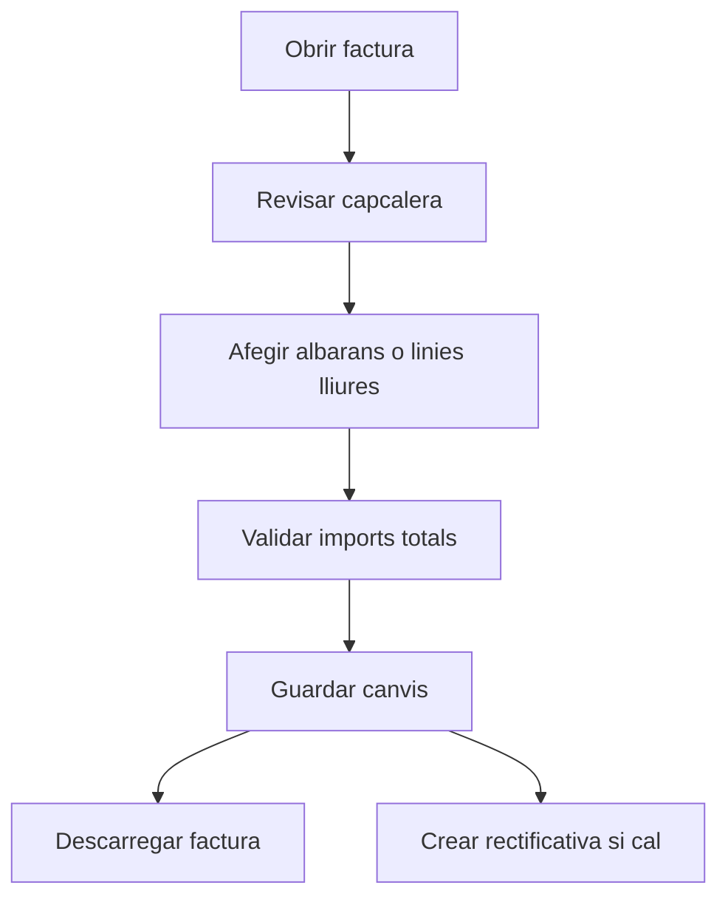

# Factura de venda

## Per a que serveix aquesta pantalla

La fitxa de factura permet mantenir la capcalera, revisar els imports principals i construir el detall a partir d'albarans o de linies lliures. Tambe permet descarregar el document i generar una factura rectificativa quan correspongui.

## Accions disponibles

- Guardar canvis de la capcalera.
- Descarregar la factura.
- Afegir albarans pendents de facturar.
- Afegir una linia lliure manual.
- Eliminar una linia lliure.
- Desassignar un albara de la factura.
- Crear una factura rectificativa.
- Consultar l'estat d'integracio amb Verifactu quan existeix.

## Flux habitual

1. Revisa les dades generals de la factura.
2. Desa els canvis de capcalera si has modificat dates o dades comercials.
3. Completa el detall afegint albarans o, si cal, una linia lliure.
4. Revisa base imposable, impostos i total.
5. Descarrega el document o crea una rectificativa si la factura s'ha d'abonar parcialment o totalment.

## Aspectes importants

- Les factures rectificatives no funcionen com una factura ordinaria. Quan una factura te `parentSalesInvoiceId`, el detall deixa de ser editable.
- El detall pot contenir dos origens diferents: linies lliures creades manualment i linies provinents d'albarans. Cal distingir-les abans d'eliminar o modificar contingut.
- Si elimines un albara des de la factura, estas desvinculant l'albara complet de la factura, no eliminant nomes una linia.
- El bloc de totals resumeix base, impostos i total per validar rapidament el resultat abans de descarregar el document.

## Errors frequents

- Si no pots editar el detall, comprova si es tracta d'una factura rectificativa.
- Si no apareixen albarans per afegir, pot ser que no hi hagi albarans pendents de facturar per al client.
- Si una linia lliure no quadra en imports, revisa quantitat, preu unitari i impost seleccionat.
- Si la rectificativa falla, comprova la quantitat indicada i el missatge retornat pel sistema.
- Si el document no es descarrega, torna-ho a provar i valida que la factura estigui correctament generada.

## Proces basic

