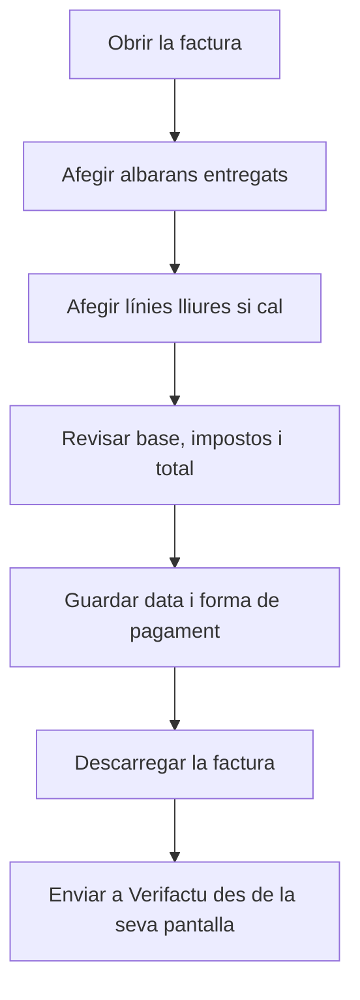

# Factura de venda

## Per a que serveix aquesta pantalla

És la fitxa d'una factura de venda. Hi afegeixes els albarans entregats del client o línies lliures, revises la base, els impostos i el total, en descarregues el document i, si cal, en crees una factura rectificativa. És l'últim pas del circuit `pressupost -> comanda -> albarà -> factura`; l'enviament a Verifactu es fa després, des d'una altra pantalla.

## Accions disponibles

- Desar la capçalera amb «Guardar»: «Data Factura», «Estat» i «Métode Pagament». En desar, tornes a la pantalla anterior.
- Obrir el menú de la fletxa del botó «Guardar» per a:
  - «Descarregar»: la factura en Word.
  - «Imprimir PDF»: la factura en PDF.
  - «Factura rectificativa»: obre el diàleg «Crear factura rectificativa».
- Consultar els totals a les targetes «Base imposable», «Impostos» i «Total factura», i l'estat d'enviament a la targeta «Verifactu».
- Pestanya «Detalls de la factura»:
  - Afegir albarans amb el botó «Crear albarà»: s'obre el «Selector d'albarans d'entrega» amb els albarans del client pendents de facturar.
  - Afegir una línia lliure amb «Afegir línia»: «Descripció», «Impost», «Quantitat» i «Preu unitat»; el «Total» es calcula sol.
  - Eliminar una línia lliure amb la creu de la línia.
  - Treure un albarà sencer de la factura amb la creu de la capçalera del seu grup.
- Pestanya «Dades fiscals»: corregir les dades fiscals del client en aquesta factura i desar-les amb «Desar dades fiscals».

## Flux habitual

1. Crea la factura des de «Factures de venda» i s'obre aquesta fitxa.
2. Prem «Crear albarà», marca els albarans entregats que vols facturar i confirma.
3. Si cal facturar algun concepte que no ve d'un albarà, afegeix-lo amb «Afegir línia».
4. Revisa la «Base imposable», els «Impostos» i el «Total factura».
5. Comprova la «Data Factura» i el «Métode Pagament» i prem «Guardar».
6. Descarrega la factura en PDF o Word per enviar-la al client.

## Aspectes importants

- Les línies s'agrupen per albarà. Les línies d'un albarà no s'eliminen una a una: es treu l'albarà sencer. Cap línia s'edita: per canviar una línia lliure, elimina-la i torna-la a crear.
- Només es poden afegir albarans del mateix client, a l'estat «Entregat», amb línies i que no siguin en cap altra factura. Cada línia agafa l'impost de la seva referència o, si no en té, l'IVA del 21 %.
- En afegir un albarà, les seves comandes passen a «Comanda Facturada» i l'albarà queda bloquejat. En treure'l, l'albarà torna a quedar lliure per facturar i les comandes tornen a «Comanda Servida».
- La base, els impostos i el total es recalculen sols, agrupats per impost, cada vegada que afegeixes o treus línies o albarans.
- Els venciments es generen sols a partir de la forma de pagament i de la data de la factura: el total es reparteix entre el nombre de pagaments de la forma de pagament. Es recalculen en desar la capçalera i en canviar les línies. Les formes de pagament es configuren a «Formes de pagament».
- El desplegable «Estat» només ofereix els estats als quals es pot passar des de l'actual, segons «Cicles de vida».
- «Crear factura rectificativa» sempre crea una factura nova, amb número nou i data d'avui, que copia totes les línies de l'original en negatiu. Si marques «Crear factura amb import corregit», també en crea una segona amb una sola línia pel valor d'«Import a facturar sense IVA», que no pot superar la base de l'original. La factura original no canvia.
- Les factures rectificatives no es poden modificar: els botons del detall queden desactivats i el menú no ofereix «Factura rectificativa».
- La targeta «Verifactu» mostra l'estat d'enviament de la factura. L'enviament no es fa des d'aquí, sinó des d'«Integració de Factures a Verifactu».
- La pestanya «Dades fiscals» només surt mentre l'estat Verifactu és «Pendent» o «Error». En desar, les dades també s'actualitzen a la fitxa del client. Si el client té altres factures pendents o amb error, el sistema pregunta si també s'hi han d'aplicar: «Sí, propagar» les actualitza totes i «Cancel·lar» no desa res.

## Errors frequents

- Si «Guardar» no desa, revisa els avisos «La data de factura és obligatòria» i «El mètode de pagament és obligatori».
- Si el selector d'albarans surt buit, comprova a «Albarans d'entrega» que els albarans del client estiguin a l'estat «Entregat» i que no siguin ja en una altra factura.
- Si surt «No es pot facturar un albarà sense línies», afegeix comandes a l'albarà abans de facturar-lo.
- Si surt «No existeix l'impost IVA 21%», cal donar d'alta un impost del 21 % a «Impostos».
- Si els botons del detall surten desactivats, la factura és una rectificativa i no es pot modificar.
- Si en crear la rectificativa surt «La quantitat introduïda no pot ser superior a la quantitat de la factura», l'import corregit ha de ser igual o inferior a la base imposable de la factura original.
- Si en desar les dades fiscals surt «CIF/NIF invàlid», revisa el «NIF/CIF».
- Si no veus la pestanya «Dades fiscals», l'estat Verifactu de la factura ja no és «Pendent» ni «Error», normalment perquè ja s'ha enviat correctament, i les seves dades fiscals ja no es poden canviar.

## Proces basic

```mermaid
flowchart TD
    A[Obrir la factura] --> B[Afegir albarans entregats]
    B --> C[Afegir línies lliures si cal]
    C --> D[Revisar base, impostos i total]
    D --> E[Guardar data i forma de pagament]
    E --> F[Descarregar la factura]
    F --> G[Enviar a Verifactu des de la seva pantalla]
```
