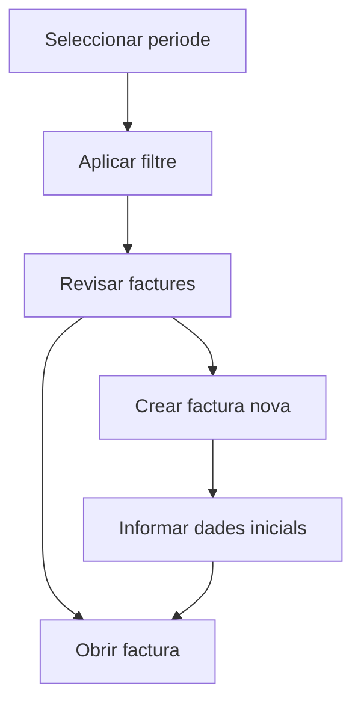

# Factures de venda

## Per a que serveix aquesta pantalla

La pantalla de factures de venda permet consultar les factures emeses en un periode, filtrar-les per client i crear factures noves. Es la llista operativa de facturacio, diferent de la pantalla de comptabilitzacio massiva per periode.

## Accions disponibles

- Seleccionar un periode de treball.
- Filtrar per client.
- Netejar els filtres actius.
- Crear una factura nova.
- Obrir una factura existent.
- Eliminar una factura des de la llista quan el sistema ho permet.

## Flux habitual

1. Selecciona el periode que vols revisar.
2. Si cal, filtra per client.
3. Prem el boto de filtre per carregar els resultats.
4. Obre una factura existent o crea'n una de nova.
5. Si crees una factura, informa primer les dades basiques al dialeg inicial i continua des de la fitxa.

## Aspectes importants

- Aquesta pantalla es fa servir per a la gestio habitual de factures. La pantalla `Comptabilitzacio de factures de venda` esta orientada a canvis massius d'estat per periode.
- La creacio de la factura passa per un dialeg inicial on s'informa client, exercici i data.
- La pantalla conserva els filtres de l'usuari mentre canvies de vista, fet que ajuda a reprendre la feina en el mateix punt.
- Despres de netejar filtres, pot quedar sense periode seleccionat fins que en tornis a indicar un.

## Errors frequents

- Si no apareixen factures, comprova el periode seleccionat.
- Si no trobes una factura concreta, revisa el filtre de client.
- Si la creacio falla, valida les dades del dialeg inicial i revisa el missatge retornat pel sistema.
- Si no pots eliminar un registre, pot estar bloquejat pel seu estat o per processos ja executats.

## Proces basic

