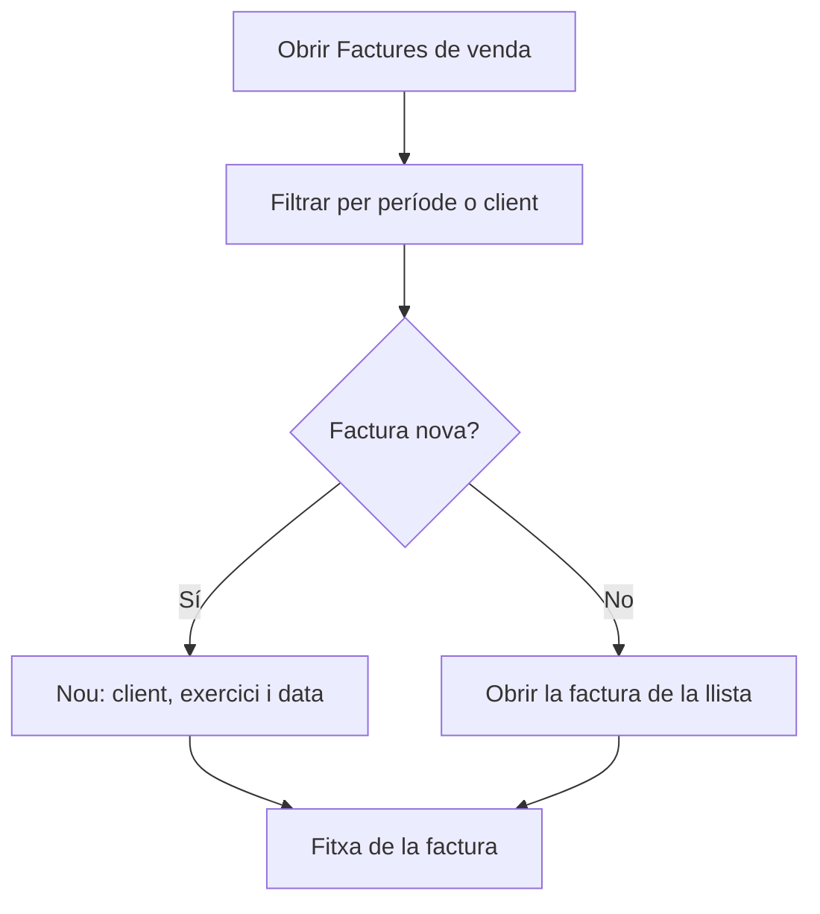

# Factures de venda

## Per a que serveix aquesta pantalla

És la llista de les factures de venda. Hi cerques les factures d'un període, les filtres per client, n'obres una o en crees una de nova. La factura és l'últim document del circuit de venda: `pressupost -> comanda -> albarà -> factura`. Per marcar moltes factures com a gestionades alhora, fes servir «Comptabilització de factures de venda».

## Accions disponibles

- Filtrar per «Període» i «Client», i aplicar el filtre amb «Filtrar».
- Restablir els filtres amb «Netejar»: treu el client i torna el període a l'any en curs. Després prem «Filtrar» per recarregar la llista.
- Crear una factura amb «Nou»: s'obre el diàleg «Crear factura», on tries el «Client», l'«Exercici» i la «Data».
- Obrir una factura fent clic a la fila.
- Eliminar una factura amb la icona de la paperera («Eliminar»), després de confirmar-ho.

La taula mostra el «Número», la «Data», el «Client», l'«Estat», el «Venciment» (l'últim venciment de la factura) i l'«Import» total.

## Flux habitual

1. Obre «Factures de venda». Es carreguen les factures de l'any en curs, o els últims filtres que vas fer servir.
2. Ajusta el període o el client i prem «Filtrar».
3. Per facturar entregues, prem «Nou», tria el client, revisa l'exercici i la data de factura i confirma.
4. En crear-la s'obre la fitxa de la factura, on hi afegeixes els albarans entregats o línies lliures.
5. Per revisar o descarregar una factura existent, fes clic a la seva fila.

## Aspectes importants

- El període filtra per la data de la factura. La pantalla recorda el període i el client quan en surts.
- La «Data» del diàleg és la data de la factura. L'exercici proposat és el que té com a nom l'any en curs, i el número de factura el posa el sistema amb el comptador d'aquest exercici.
- En crear la factura es copien les dades fiscals del client (nom, NIF, número de compte i adreça principal) i la seva forma de pagament. Canvis posteriors a la fitxa del client no modifiquen la factura.
- La factura nova neix a l'estat inicial del seu cicle de vida («Cicles de vida») i amb l'estat Verifactu inicial, pendent d'enviar.
- El client ha de tenir el nom fiscal, el NIF i el número de compte informats i almenys una adreça activa, i la seu per defecte de l'empresa ha de tenir les dades de facturació completes.
- La paperera només surt a les factures que són a l'estat inicial del cicle de vida. Eliminar una factura l'esborra definitivament i allibera els seus albarans, que es poden tornar a facturar.

## Errors frequents

- Si no surt cap factura, comprova que el període tingui data d'inici i de fi i que el filtre de client sigui el correcte.
- Si en crear la factura surt «El client no és vàlid per a crear una factura», completa el nom fiscal, el NIF i el número de compte del client a «Clients».
- Si surt «El client no té direccions donades d'alta», afegeix una adreça al client.
- Si la creació falla amb un error del servidor, comprova que el client tingui una forma de pagament assignada.
- Si surt que la seu no és vàlida, revisa les dades de facturació de la seu per defecte de l'empresa.
- Si no veus la paperera en una factura, és que ja no és a l'estat inicial.

## Proces basic

```mermaid
flowchart TD
    A[Obrir Factures de venda] --> B[Filtrar per període o client]
    B --> C{Factura nova?}
    C -->|Sí| D[Nou: client, exercici i data]
    D --> E[Fitxa de la factura]
    C -->|No| F[Obrir la factura de la llista]
    F --> E
```
