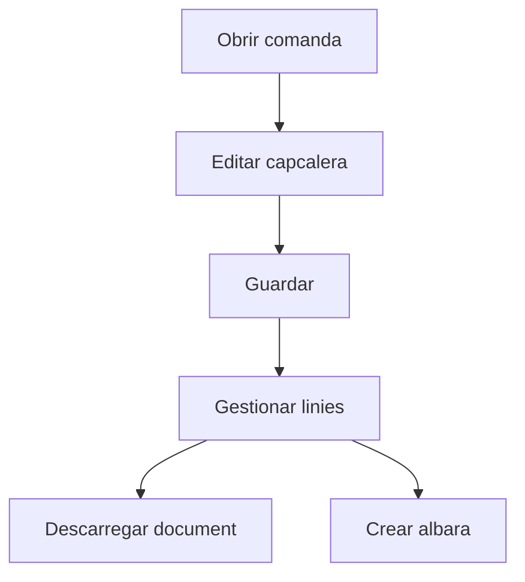

# Comanda de venda

## Per a que serveix aquesta pantalla

La pantalla de detall de comanda permet mantenir la capcalera, revisar les linies, consultar fitxers relacionats i executar accions operatives com generar l'albara.

## Accions disponibles

- Guardar canvis de la comanda.
- Descarregar la comanda amb o sense preus.
- Crear l'albara associat.
- Afegir, editar i eliminar linies.
- Consultar fitxers vinculats a la comanda.

## Flux habitual

1. Revisa les dades generals de la comanda.
2. Desa els canvis si has modificat la capcalera.
3. Gestiona les linies de la comanda.
4. Quan estigui preparada, genera l'albara o descarrega el document.

## Errors frequents

- Si no pots guardar, revisa que la data de la comanda estigui informada.
- Si no es genera l'albara, comprova si la comanda ja en te un d'associat.
- Si una linia no es veu correctament, torna a obrir la comanda per refrescar dades.

## Proces basic

