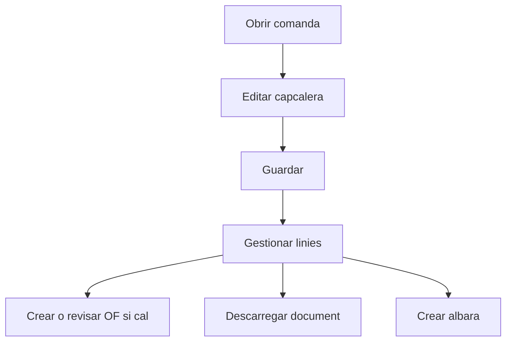

# Comanda de venda

## Per a que serveix aquesta pantalla

La fitxa de comanda permet mantenir la capcalera, gestionar les linies de venda, consultar fitxers relacionats i executar accions operatives com crear l'albara o treballar amb ordres de fabricacio associades a les linies.

## Accions disponibles

- Guardar canvis de la comanda.
- Descarregar la comanda amb o sense preus.
- Crear l'albara associat.
- Afegir, editar i eliminar linies.
- Consultar i gestionar fitxers vinculats.
- Crear una ordre de fabricacio des d'una linia quan correspongui.
- Obrir l'ordre de fabricacio associada a una linia.

## Flux habitual

1. Revisa les dades generals de la comanda.
2. Desa els canvis si has modificat la capcalera.
3. Gestiona les linies de la comanda.
4. Si alguna linia necessita fabricacio, crea o revisa la seva ordre de fabricacio.
5. Quan la comanda estigui preparada, descarrega el document o crea l'albara.

## Aspectes importants

- La comanda es un punt clau del flux comercial, ja que connecta el pressupost amb l'albara i pot tenir impacte directe en produccio.
- Si la comanda ja te un albara associat, part de l'edicio del detall pot quedar funcionalment limitada.
- La generacio d'ordres de fabricacio es fa per linia, no per tota la comanda de cop.
- La diferencia entre costos teorics, costos reals o dades de fabricacio pot ser rellevant per interpretar correctament el detall.

## Errors frequents

- Si no pots guardar, revisa que la data de la comanda estigui informada.
- Si no es genera l'albara, comprova si la comanda ja en te un d'associat.
- Si una linia no es veu correctament o no reflecteix canvis recents, torna a obrir la comanda per refrescar dades.
- Si una accio de fabricacio no esta disponible, revisa si la referencia de la linia admet o necessita ordre de fabricacio.

## Proces basic

