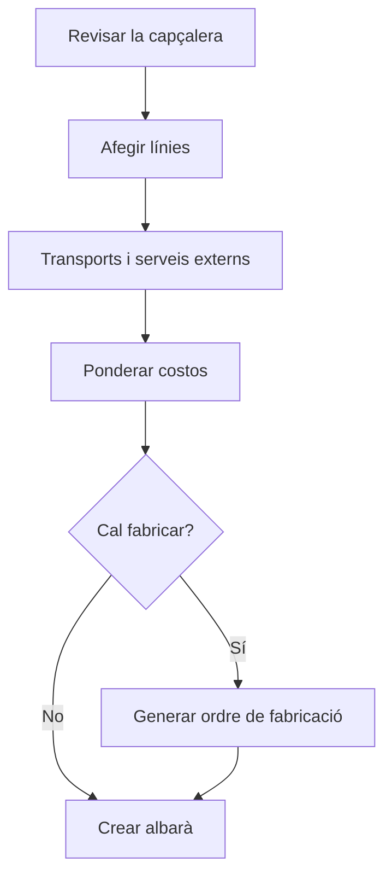

# Comanda

## Per a que serveix aquesta pantalla

És la fitxa d'una comanda de venda. Hi mantens la capçalera, les línies amb els seus costos i preus, els transports, els serveis externs i els fitxers adjunts. Des d'aquí també generes les ordres de fabricació de cada línia i crees l'albarà de la comanda, dins del circuit `pressupost -> comanda -> albarà -> factura`.

## Accions disponibles

- Desar la capçalera amb «Guardar». En desar, tornes a la pantalla anterior.
- Obrir el menú de la fletxa del botó «Guardar» per a:
  - «Descarregar»: la comanda en Word, amb preus.
  - «Imprimir PDF»: la comanda en PDF, amb preus.
  - «Descarregar sense preu»: la comanda en Word, sense preus.
  - «Crear albarà»: crea l'albarà d'entrega amb totes les línies de la comanda i l'obre.
- Canviar l'«Estat» de la comanda amb el desplegable.
- Obrir la fitxa del client amb la lupa del costat del camp «Client».
- Pestanya «Detall»: afegir línies amb «Afegir línia», editar una línia fent-hi clic, eliminar-la amb la creu i repartir costos amb «Ponderar costos».
- A la columna «Ordre fabr.» de cada línia: generar-ne l'ordre de fabricació amb el botó «+», o obrir l'ordre ja generada amb el botó que en mostra el codi.
- Pestanya «Transports»: afegir-ne amb «Afegir transport» i editar-los fent-hi clic.
- Pestanya «Serveis externs»: triar el «Proveïdor» de cada servei extern.
- Pestanya «Fitxers»: pujar, previsualitzar, descarregar i eliminar documents de la comanda.

## Flux habitual

1. Revisa la capçalera: «Client», «Comanda Client», «Data Alta» i «Data Entrega».
2. A «Detall», prem «Afegir línia», tria la «Referència» i, si en té, la «Ruta de fabricació»; ajusta la «Quantitat», els marges i el «Descompte» i desa la línia.
3. Si cal, afegeix els transports i tria el proveïdor dels serveis externs; després prem «Ponderar costos».
4. Per a cada línia que s'hagi de fabricar, prem «+» a «Ordre fabr.», revisa la ruta, la quantitat i la «Data prevista» i genera l'ordre.
5. Quan la comanda estigui a punt per entregar, tria «Crear albarà» al menú de «Guardar».
6. Descarrega el document amb o sense preus si l'has d'enviar al client.

## Aspectes importants

- «Num. Comanda», «Num. Pressupost» i «Albarà Entrega» són de només lectura. Els dos últims mostren el pressupost d'origen i l'albarà on és la comanda.
- El desplegable «Estat» només ofereix els estats als quals es pot passar des de l'actual, segons el cicle de vida configurat a «Cicles de vida».
- A més, el sistema canvia l'estat de la comanda sol: passa a «Comanda Servida» quan el seu albarà s'entrega, a «Comanda Facturada» quan l'albarà s'afegeix a una factura, i torna a «Comanda» si es treu de l'albarà.
- Quan la comanda ja és en un albarà, les línies queden bloquejades: desapareixen «Afegir línia», «Ponderar costos» i «Afegir transport», les línies no s'obren ni s'eliminen i el botó «+» per generar ordres queda desactivat.
- Una línia amb ordre de fabricació o ja entregada no es pot eliminar: la creu no hi surt.
- Al diàleg de la línia, la «Referència» només mostra les referències d'aquest client i les que no són de cap client. En triar-la s'omplen la descripció, el preu i el cost; si la referència té una sola ruta de fabricació activa, es tria sola i els costos surten de la ruta. La pestanya «Marges» permet ajustar el benefici per fase.
- «Ponderar costos» reparteix el preu dels transports entre les línies segons el pes i el dels serveis externs segons la tarifa de compra del proveïdor, i després recalcula el «Preu unitari» i el total de cada línia a partir del cost, el benefici i el descompte. Els preus que havies tocat a mà se sobreescriuen.
- Els serveis externs els calcula el sistema a partir de les fases externes de les rutes de les línies. En triar el proveïdor, el preu es calcula amb la seva tarifa i es desa sense prémer «Guardar».
- A les línies, «Cost un. teo.» i «Cost teòric» surten de la ruta de fabricació, i «Cost un. r.» i «Cost real» de l'ordre de fabricació ja executada.
- La comanda no mou estoc. L'estoc surt del magatzem quan l'albarà passa a l'estat «Entregat».
- «Crear albarà» crea l'albarà amb la data d'avui, a l'exercici de la data actual i a l'estat inicial. Una comanda només pot estar en un albarà.

## Errors frequents

- Si en desar surt «La data no pot estar buida», informa la «Data Alta».
- Si «Crear albarà» avisa «Aquest document ja té un document associat», la comanda ja és en un albarà: busca'l a «Albarans d'entrega» pel número que surt a «Albarà Entrega».
- Si «Crear albarà» falla amb «No s'ha trobat cap exercici per a la data actual», cal donar d'alta l'exercici de l'any en curs a «Exercicis».
- Si no pots editar ni eliminar línies, comprova si la comanda ja té albarà. Mentre l'albarà no estigui entregat ni facturat, pots treure-hi la comanda des de la fitxa de l'albarà.
- Si en generar l'ordre de fabricació surt «La ruta de fabricació és obligatòria», la referència no té cap ruta activa: crea-la o activa-la abans.
- Si surt «No s'han pogut ponderar els costos.», comprova que la comanda tingui línies.

## Proces basic

```mermaid
flowchart TD
    A[Revisar la capçalera] --> B[Afegir línies]
    B --> C[Transports i serveis externs]
    C --> D[Ponderar costos]
    D --> E{Cal fabricar?}
    E -->|Sí| F[Generar ordre de fabricació]
    E -->|No| G[Crear albarà]
    F --> G
```
