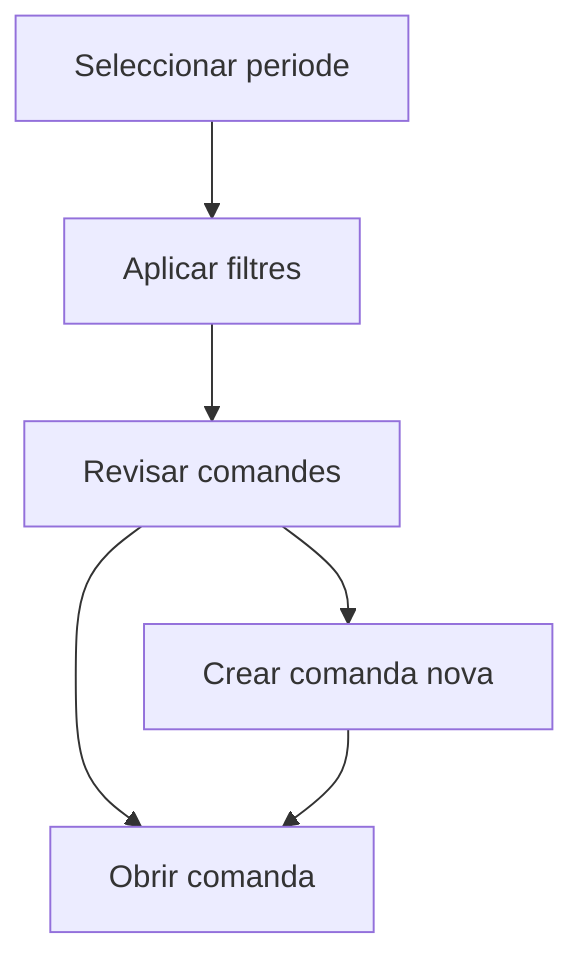

# Comandes

## Per a que serveix aquesta pantalla

La pantalla de comandes permet consultar les comandes de venda del periode seleccionat, aplicar filtres i crear noves comandes.

## Accions disponibles

- Filtrar per exercici, client i estat.
- Netejar els filtres actius.
- Crear una comanda nova.
- Obrir una comanda existent des de la taula.
- Eliminar una comanda pendent si encara no ha avancat en el proces.

## Flux habitual

1. Selecciona el periode de treball.
2. Aplica filtres per client o estat si ho necessites.
3. Revisa la llista de comandes.
4. Obre una comanda existent o crea'n una de nova.

## Errors frequents

- Si no es mostren dades, comprova que hi hagi un periode seleccionat.
- Si una comanda no es pot eliminar, potser ja no esta en estat inicial.
- Si el filtre no dona el resultat esperat, neteja'l i torna'l a aplicar.

## Proces basic

