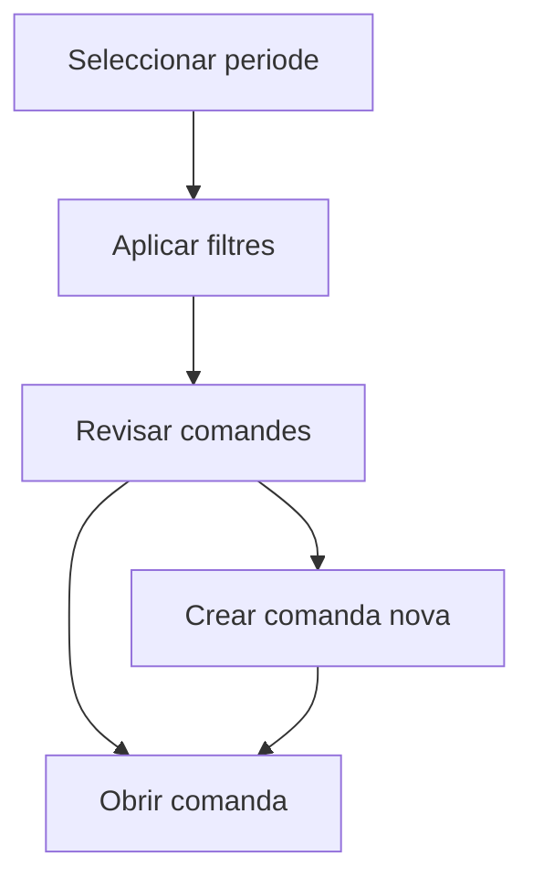

# Comandes de venda

## Per a que serveix aquesta pantalla

La pantalla de comandes de venda permet consultar les comandes del periode seleccionat, aplicar filtres comercials i crear noves comandes. Es la llista operativa del document que connecta el pressupost amb l'entrega.

## Accions disponibles

- Seleccionar un periode de treball.
- Filtrar per client.
- Filtrar per estat.
- Netejar els filtres actius.
- Crear una comanda nova.
- Obrir una comanda existent.
- Eliminar una comanda si encara es troba en l'estat inicial.

## Flux habitual

1. Selecciona el periode que vols revisar.
2. Aplica filtres per client o estat si ho necessites.
3. Prem el boto de filtre per carregar la llista.
4. Revisa les comandes trobades.
5. Obre una comanda existent o crea'n una de nova.

## Aspectes importants

- La pantalla desa els filtres de l'usuari, de manera que en tornar acostumes a recuperar el mateix context de treball.
- La creacio manual de comandes conviu amb la creacio a partir de pressupostos.
- La icona d'eliminar nomes es mostra quan la comanda es troba a l'estat inicial del cicle de vida.
- Aquesta pantalla es especialment util per seguir el pas entre l'oferta acceptada i la preparacio de l'entrega.

## Errors frequents

- Si no es mostren dades, comprova que hi hagi un periode seleccionat.
- Si una comanda no es pot eliminar, probablement ja no es troba en l'estat inicial.
- Si el filtre no dona el resultat esperat, neteja'l i torna'l a aplicar.
- Si no saps si has de crear la comanda des d'aqui o des d'un pressupost, revisa primer si el pressupost ja existeix i s'ha de convertir.

## Proces basic

