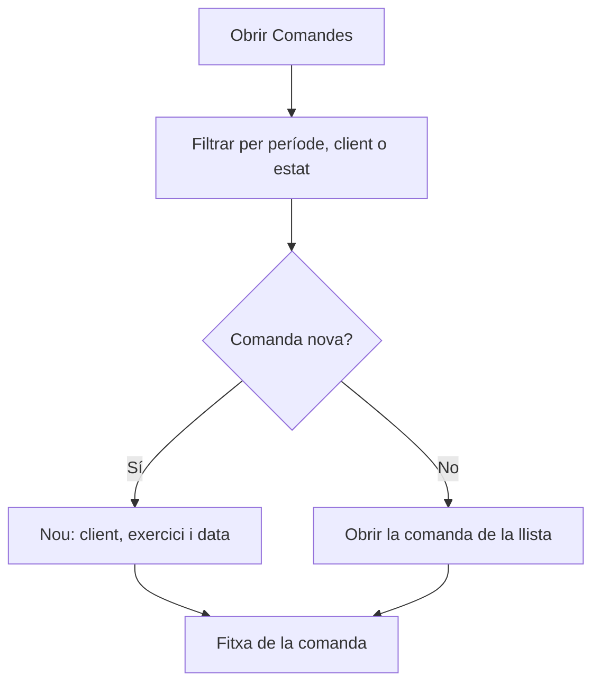

# Comandes

## Per a que serveix aquesta pantalla

És la llista de les comandes de venda. Hi cerques les comandes d'un període, les filtres per client o per estat, n'obres una o en crees una de nova. La comanda és el segon pas del circuit de venda: `pressupost -> comanda -> albarà -> factura`. També es pot crear una comanda a partir d'un pressupost, des de la pantalla «Pressupostos» amb «Crear comanda».

## Accions disponibles

- Filtrar per «Període», «Client» i «Estat», i aplicar el filtre amb «Filtrar».
- Restablir els filtres amb «Netejar»: treu el client i l'estat, torna el període a l'any en curs i recarrega la llista.
- Crear una comanda amb «Nou»: s'obre el diàleg «Crear comanda», on tries el «Client», l'«Exercici» i la «Data».
- Obrir una comanda fent clic a la fila.
- Consultar els fitxers adjunts d'una comanda amb la icona del clip («Adjunts»), sense sortir de la llista.
- Eliminar una comanda amb la icona de la paperera («Eliminar»), després de confirmar-ho.

La taula mostra el «Número», la «Data», la «Data d'entrega», el «Client», la «Comanda del client» (la referència de comanda del client) i l'«Estat».

## Flux habitual

1. Obre «Comandes». Es carreguen les comandes de l'any en curs, o els últims filtres que vas fer servir.
2. Ajusta el període, el client o l'estat i prem «Filtrar».
3. Per a una comanda nova, prem «Nou», tria el client, revisa l'exercici i la data i confirma.
4. En crear-la s'obre directament la fitxa de la comanda, on hi afegeixes les línies.
5. Per revisar o continuar una comanda existent, fes clic a la seva fila.

## Aspectes importants

- El període filtra per la data de la comanda. Si no hi ha un període complet (data d'inici i de fi), la llista no es carrega i surt l'avís «Selecciona un període».
- La pantalla recorda el període, el client i l'estat quan en surts i els recupera quan hi tornes.
- L'exercici proposat és el que té com a nom l'any en curs. El número de la comanda el posa el sistema amb el comptador d'aquest exercici.
- La comanda nova neix a l'estat inicial del cicle de vida de les comandes, que es configura a «Cicles de vida».
- El client ha de tenir el nom fiscal, el NIF i el número de compte informats, i almenys una adreça activa. La seu per defecte de l'empresa també ha de tenir completes les dades de facturació (adreça, població, codi postal, província, país i NIF).
- La paperera només surt a les comandes que són a l'estat inicial del cicle de vida.
- Eliminar una comanda l'esborra definitivament. Si la comanda venia d'un pressupost, el pressupost torna al seu estat inicial i perd la data d'acceptació, de manera que es pot tornar a convertir en comanda.

## Errors frequents

- Si surt «Selecciona un període», indica una data d'inici i una de fi i torna a prémer «Filtrar».
- Si en crear la comanda surt «El client no és vàlid per a crear una factura», completa el nom fiscal, el NIF i el número de compte a la fitxa del client, a «Clients».
- Si surt «El client no té direccions donades d'alta», afegeix una adreça al client.
- Si surt que la seu no és vàlida, revisa les dades de facturació de la seu per defecte de l'empresa.
- Si no veus la paperera en una comanda, és que ja no és a l'estat inicial: canvia'n l'estat des de la fitxa si cal.

## Proces basic

```mermaid
flowchart TD
    A[Obrir Comandes] --> B[Filtrar per període, client o estat]
    B --> C{Comanda nova?}
    C -->|Sí| D[Nou: client, exercici i data]
    D --> E[Fitxa de la comanda]
    C -->|No| F[Obrir la comanda de la llista]
    F --> E
```
