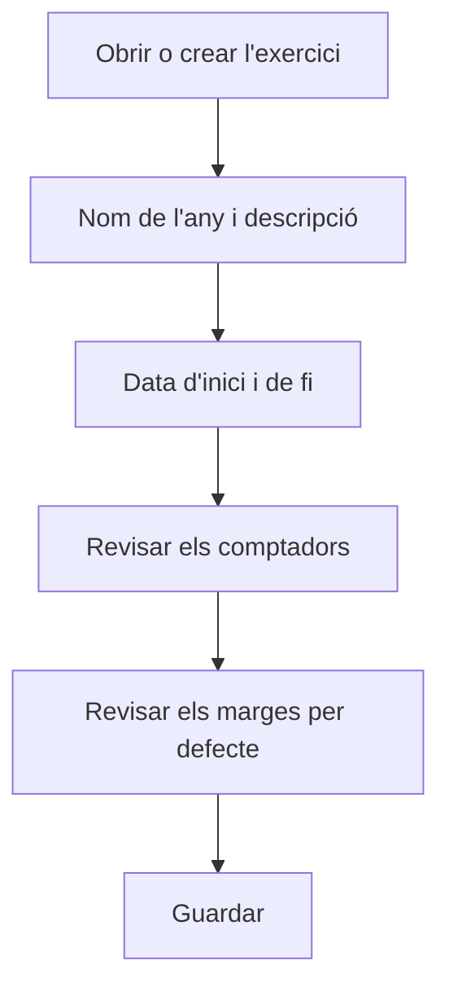

# Exercici

## Per a que serveix aquesta pantalla

És la fitxa d'un exercici. Hi defineixes el període de dates, els comptadors amb què es numeren els documents de l'exercici i els marges per defecte de les línies noves. Tots els documents de venda i de compra que es numeren en aquest exercici prenen el número d'aquí: pressupost, comanda, albarà i factura, i també comanda, albarà i factura de compra.

## Accions disponibles

- Omplir «Nom», «Descripció», «Data inici» i «Data fi».
- Ajustar els comptadors: «Pressupostos», «Comandes de venta», «Albarans de venta», «Factures de venta», «Comandes de compra», «Albarans de recepció» i «Factures de compra».
- Definir «Marge material per defecte (%)» i «Marge extern per defecte (%)».
- Marcar «Desactivat» quan l'exercici ja no s'hagi d'utilitzar.
- Desar amb «Guardar», a la capçalera. En desar, tornes a la pantalla anterior.

## Flux habitual

1. Des de «Exercicis», toca «+» o obre l'exercici que vols revisar.
2. Escriu com a nom l'any, per exemple «2027», i una descripció.
3. Indica la data d'inici i la de fi de l'exercici.
4. En un exercici nou, deixa els comptadors buits o a 0 perquè la numeració comenci per 1.
5. Revisa els marges per defecte.
6. Toca «Guardar».

## Aspectes importants

- «Nom», «Descripció», «Data inici» i «Data fi» són obligatoris, i la data de fi ha de ser posterior a la d'inici. No hi pot haver dos exercicis amb el mateix nom.
- Cada comptador guarda l'últim número utilitzat d'aquell tipus de document, amb tres xifres. El número del document següent són les dues últimes xifres del nom de l'exercici seguides del comptador més u. Per exemple, a l'exercici «2026», amb «Factures de venta» a 041, la factura següent serà la 26042 i el comptador passarà a 042.
- Per això el nom ha d'acabar en dues xifres (l'any) i els comptadors només poden contenir xifres.
- El comptador té tres xifres: a partir del document 999 d'un tipus dins l'exercici, la numeració deixa de ser correcta.
- Si modifiques un comptador, canvies el número del document següent. No el baixis per sota de l'últim número emès: en desar l'exercici no es comprova i es podrien repetir números.
- Les ordres de fabricació també es numeren amb un comptador de l'exercici, que no es mostra en aquest formulari.
- En crear un document a mà, es tria l'«Exercici» al diàleg de creació (es proposa el que es diu com l'any en curs). Quan el document es genera automàticament, s'usa l'exercici que inclou la data: la d'avui per a comandes des de pressupost i albarans des de comanda, la data planificada per a les ordres de fabricació i la data de la factura per a les factures de compra.
- Els marges per defecte es proposen a les línies noves dels pressupostos i de les comandes de venda d'aquest exercici. El marge extern també es proposa quan una fase d'una ruta de fabricació es marca com a treball extern, amb l'exercici vigent avui. Un exercici nou comença amb un 30 % en tots dos.
- Si deixes un marge a 0, les línies noves proposen igualment un 30 %.
- Un exercici desactivat no serveix per crear factures de compra.

## Errors frequents

- Si en desar surt «La data final de l'exercici ha de ser posterior a l'inici», revisa «Data inici» i «Data fi».
- Si en desar un exercici nou surt un error, comprova que no n'hi hagi cap altre amb el mateix nom.
- Si en crear un document surt «Error al crear el comptador» o un error inesperat, revisa que el nom de l'exercici acabi en dues xifres i que el comptador d'aquell document només tingui xifres.
- Si surt «No s'ha trobat cap exercici per a la data actual», revisa les dates de l'exercici: la data del document ha de quedar entre l'inici i la fi.

## Proces basic

