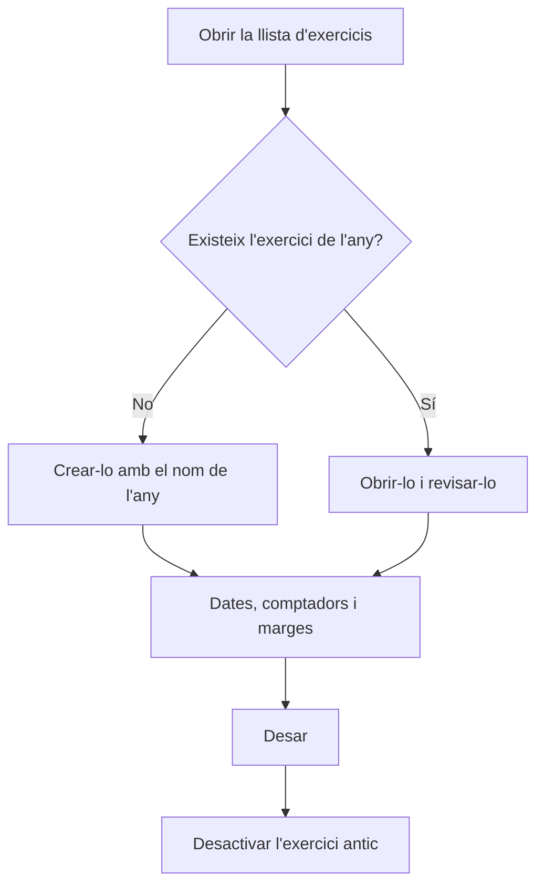

# Exercicis

## Per a que serveix aquesta pantalla

Llista els exercicis, els períodes de dates (normalment un any) amb què l'empresa numera els documents. Cada exercici té els seus comptadors de pressupostos, comandes, albarans i factures, i els marges per defecte que es proposen a les línies noves. Cal que hi hagi un exercici que cobreixi les dates en què es creen els documents; si no, el programa no els pot numerar.

## Accions disponibles

- Consultar el nom, la descripció, la «Data d'inici», el «Dia de fi» i si l'exercici està «Desactivat».
- Crear un exercici nou amb el botó verd «+» («Crear nou»).
- Obrir un exercici fent clic a la seva fila per revisar-ne els comptadors o les dates.

## Flux habitual

1. Abans que comenci l'any, obre la llista d'exercicis.
2. Toca «+» per crear l'exercici nou.
3. Posa-li com a nom l'any, per exemple «2027», i les dates d'inici i de fi de l'any.
4. Revisa els comptadors i els marges per defecte i desa'l.
5. Quan l'exercici anterior ja no s'hagi d'utilitzar, obre'l i marca'l com a «Desactivat».

## Aspectes importants

- Posa com a nom de l'exercici l'any amb quatre xifres. Els números dels documents comencen amb les dues últimes xifres del nom, i diverses pantalles proposen per defecte l'exercici que es diu com l'any en curs.
- Crea l'exercici de l'any següent abans que comenci. Quan el programa genera un document automàticament (una comanda des d'un pressupost, un albarà des d'una comanda o una ordre de fabricació), busca l'exercici que inclou la data; si no n'hi ha cap, no el crea.
- Evita que dos exercicis tinguin dates que se solapin: quan el programa busca l'exercici d'una data, només en pren un.
- Aquesta pantalla no permet eliminar exercicis. Per deixar d'utilitzar-ne un, marca'l com a «Desactivat».
- Una factura de compra no es pot crear si l'exercici que inclou la data de la factura està desactivat.
- Els comptadors i els marges s'expliquen a l'ajuda de la fitxa «Exercici».

## Errors frequents

- Si en crear un document surt «No s'ha trobat cap exercici per a la data actual», crea l'exercici que inclou la data d'avui o revisa les dates de l'existent.
- Si en crear una factura de compra surt «Exercici invàlid», comprova que hi hagi un exercici que inclogui la data de la factura i que no estigui «Desactivat».
- Si en crear un document no se't proposa cap exercici, comprova que n'hi hagi un que es digui com l'any en curs.

## Proces basic

