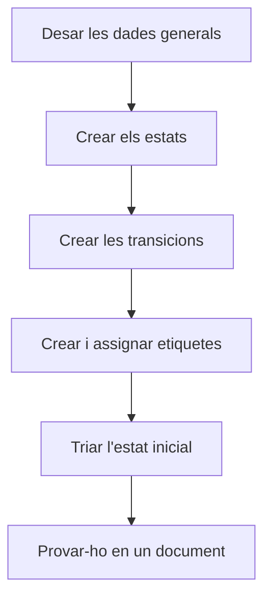

# Cicle de vida

## Per a que serveix aquesta pantalla

Configura un cicle de vida: els estats per on passa un tipus de document, les transicions que permeten passar d'un estat a un altre i les etiquetes que donen un significat especial a alguns estats. Les transicions decideixen quins estats apareixen al desplegable d'estat de cada document, i les etiquetes decideixen, per exemple, quines ordres de fabricació (OF) es poden planificar o carregar a planta. És una pantalla de configuració per a l'administrador.

## Accions disponibles

- Editar el «Nom», la «Descripció» i l'«Estat inicial» del cicle de vida, i desar-los amb «Guardar».
- A la pestanya «Estats i Transicions», afegir un estat amb el botó «+» de la taula «Estats», o obrir-lo fent clic a la fila per canviar-ne el «Nom», el «Color», la casella «Deshabilitat» i les «Etiquetes».
- Eliminar un estat amb la «X» de la fila. La «X» només surt si l'estat no forma part de cap transició.
- A la mateixa pestanya, afegir una transició amb el botó «+» de la taula «Transicions», indicant el «Nom», l'«Origen» i el «Destí». Fes clic a la fila per editar-la o a la «X» per eliminar-la.
- A la pestanya «Etiquetes», crear etiquetes amb el botó «+» (amb «Nom», «Descripció», «Color» i «Icona»), editar-les amb el llapis o eliminar-les amb la paperera.

## Flux habitual

1. Obre el cicle de vida des de «Gestió de cicles de vida».
2. A «Estats i Transicions», crea els estats que falten i tria el «Color» de cadascun.
3. Crea les transicions: una per a cada pas permès, de l'estat d'«Origen» al de «Destí».
4. Si el cicle de vida ho necessita, crea les etiquetes a «Etiquetes» i assigna-les als estats des del diàleg de cada estat.
5. Tria l'«Estat inicial» i desa amb «Guardar».
6. Obre un document d'aquest tipus i comprova que el desplegable d'estat ofereix els canvis esperats.

## Aspectes importants

- **Els noms dels estats són part del funcionament.** Molts processos automàtics busquen l'estat pel nom exacte, tal com està escrit. Per exemple, «Acceptat» i «Rebutjat» als pressupostos; «Comanda», «Comanda Servida» i «Comanda Facturada» a les comandes; «Entregat» als albarans; «Cobrada» a les factures; «Recepcionat» a les recepcions; «Rebuda», «Rebuda parcialment», «Pendent de rebre» i «Cancel·lada» a les compres; i «Creada», «Llançada», «Producció», «Pausa», «Tancada», «Servei Extern» i «Cancel·lada» a les OF. No els canviïs de nom: aquests automatismes (moviments de magatzem, canvis d'estat en cadena, tancament de fases, quadres de comandament) deixarien de funcionar o donarien «L'estat amb ID ... no existeix o està deshabilitat».
- **El nom del cicle de vida tampoc no s'ha de canviar**: el programa el busca pel seu nom intern.
- **Transicions**: al desplegable d'estat d'un document només surten els estats de destí de les transicions que surten de l'estat actual. Si falta una transició, l'usuari no podrà fer aquest canvi. A planta, en tancar o pausar una fase, el programa busca una transició de l'estat actual cap a «Tancada» o «Pausa».
- **«Deshabilitat»**: un estat deshabilitat deixa de sortir com a destí als desplegables d'estat. Els documents que ja hi són no canvien. Per retirar un estat, deshabilita'l en lloc d'eliminar-lo.
- **«Estat inicial»**: és l'estat que reben els documents nous. Si no n'hi ha, la creació d'aquells documents falla. Al cicle de vida de les OF, a més, les OF en l'estat inicial passen a «Llançada» quan es prioritzen.
- **«Color»**: és el color amb què l'estat surt a les llistes de documents. Tria'l pel significat: «En curs», «Cal actuar», «Fet», «Problema», «Tancat», «Neutre» o «Sense color».
- **Etiquetes amb significat especial** al cicle de vida de les OF: les OF en estats amb l'etiqueta `Available` són les que es poden planificar i compten per a la càrrega de les màquines (si cap estat la té, només es planifiquen les OF en l'estat inicial); `Plant` fa que les fases de l'OF surtin a les màquines de planta per carregar-les; `ExternalService` fa que les fases externes de l'OF surtin a «Generació de comandes de compra». El nom de l'etiqueta ha de coincidir exactament.
- Les etiquetes són de cada cicle de vida i no es poden repetir dins del mateix cicle de vida. El selector «Etiquetes» del diàleg d'estat només apareix quan el cicle de vida té etiquetes.
- **Eliminacions**: esborrar estats, transicions i etiquetes és definitiu i no demana confirmació. Eliminar una etiqueta la treu de tots els estats que la tenien. No eliminis mai un estat que tingui documents: la base de dades pot rebutjar l'eliminació o eliminar també els documents que hi són.
- En un cicle de vida nou, primer desa les dades generals amb «Guardar»: fins llavors no es poden afegir estats ni transicions.

## Errors frequents

- Si no pots eliminar un estat i surt «L'estat ... forma part d'una transició», elimina primer les transicions on apareix. Pensa-hi bé: potser el que convé és marcar-lo com a «Deshabilitat».
- Si en desar una transició surt «Els estats d'origen i destí han de ser diferents», revisa l'«Origen» i el «Destí».
- Si un usuari no troba un estat al desplegable d'un document, comprova que hi hagi una transició des de l'estat actual del document i que l'estat de destí no estigui «Deshabilitat».
- Si en desar una etiqueta surt que ja existeix una etiqueta amb aquest nom, tria'n un altre o edita l'existent.
- Si després de canviar el nom d'un estat falla un procés automàtic amb «L'estat amb ID ... no existeix o està deshabilitat», torna a posar el nom original exactament igual.
- Si les OF no surten a la planificació o a les màquines de planta, revisa que els estats corresponents tinguin l'etiqueta `Available` o `Plant`.

## Proces basic

