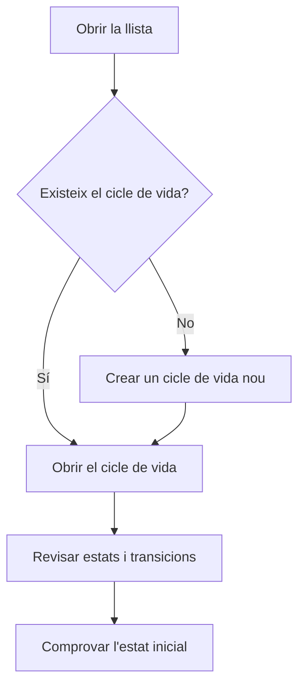

# Gestió de cicles de vida

## Per a que serveix aquesta pantalla

Llista els cicles de vida de l'aplicació. Cada cicle de vida defineix els estats per on passa un tipus de document i les transicions permeses entre ells: pressupostos, comandes, albarans, factures, comandes de compra, recepcions, ordres de fabricació (OF) i l'enviament a Verifactu. És una pantalla de configuració per a l'administrador: el que es canvia aquí afecta tots els documents del tipus corresponent.

## Accions disponibles

- Consultar cada cicle de vida amb el seu «Nom», la «Descripció» i l'«Estat Inicial».
- Crear un cicle de vida nou amb el botó «+» («Crear nou»).
- Obrir un cicle de vida fent clic a la fila per editar-ne els estats, les transicions i les etiquetes.
- Eliminar un cicle de vida amb la icona de la paperera de la fila.

## Flux habitual

1. Obre la llista i localitza el cicle de vida del document que vols revisar (per exemple, el de les ordres de fabricació).
2. Fes clic a la fila per obrir-lo.
3. Revisa o ajusta els estats, les transicions i les etiquetes a la fitxa.
4. Torna a la llista i comprova que la columna «Estat Inicial» mostra l'estat esperat.

## Aspectes importants

- El programa busca cada cicle de vida pel seu nom intern (per exemple, `Budget`, `SalesOrder`, `DeliveryNote`, `SalesInvoice`, `PurchaseOrder`, `PurchaseOrderDetail`, `PurchaseInvoice`, `Receipts`, `WorkOrder` o `Verifactu`). No canviïs aquests noms ni els eliminis: els documents d'aquell tipus deixarien de poder crear-se o de canviar d'estat.
- Crear un cicle de vida nou amb un altre nom no fa que cap document l'utilitzi: els documents només fan servir els cicles de vida amb el nom que el programa espera.
- La columna «Estat Inicial» és l'estat que reben els documents nous. Si està buida, la creació d'aquells documents falla.
- Només es pot eliminar un cicle de vida que no tingui cap estat ni cap transició. L'eliminació és definitiva i no demana confirmació.

## Errors frequents

- Si en eliminar surt «El cicle de vida ... té dependències», el cicle de vida encara té estats o transicions. Normalment vol dir que és en ús: no l'eliminis.
- Si en crear un cicle de vida surt que l'entitat ja existeix, ja n'hi ha un amb el mateix nom.
- Si en crear un document surt que el cicle de vida no té un estat inicial, obre aquell cicle de vida i informa l'«Estat inicial».

## Proces basic

