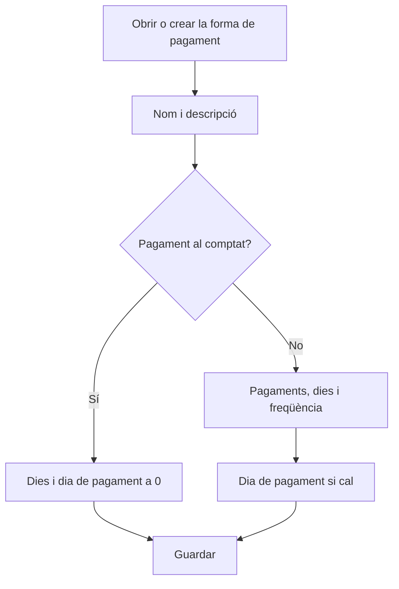

# Forma de pagament

## Per a que serveix aquesta pantalla

És la fitxa d'una forma de pagament. Aquí defineixes com es reparteix l'import d'una factura en venciments i en quines dates vencen. La forma de pagament s'assigna al client o al proveïdor i a cada factura, i el programa en calcula els venciments a partir de la data i de l'import total de la factura.

## Accions disponibles

- Omplir «Nom» i «Descripció» per identificar la forma de pagament als selectors.
- Definir el càlcul dels venciments amb «Dies venciment», «Dia de pagament», «Número de pagaments» i «Freqüència».
- Marcar «Desactivada» perquè deixi d'oferir-se a clients i factures.
- Desar amb «Guardar», a la capçalera. En desar, tornes a la pantalla anterior.

## Flux habitual

1. Des de «Formes de pagament», toca «+» o obre una forma de pagament existent.
2. Escriu el nom i la descripció, per exemple «30-60-90» i «Tres pagaments a 30, 60 i 90 dies».
3. Indica el nombre de pagaments i els dies entre venciments.
4. Si els pagaments s'han de fer un dia concret del mes, indica'l a «Dia de pagament»; si no, deixa-hi 0.
5. Toca «Guardar».

## Aspectes importants

- Tots els camps són obligatoris, excepte «Desactivada». «Nom» i «Descripció» admeten fins a 250 caràcters.
- Pagament al comptat: si «Dies venciment» i «Dia de pagament» són 0, la factura té un sol venciment per l'import total a la mateixa data de la factura.
- En els altres casos es generen tants venciments com indica «Número de pagaments». L'import total es reparteix a parts iguals i cada part s'arrodoneix a cèntims, de manera que la suma pot diferir d'un cèntim.
- Cada venciment es calcula a partir de l'anterior (el primer, a partir de la data de la factura) sumant els dies de «Freqüència». Si «Freqüència» és 0, se sumen els «Dies venciment».
- Compte: quan «Freqüència» és més gran que 0, també el primer venciment fa servir la freqüència, i «Dies venciment» no s'utilitza.
- Si els dies són un múltiple de 30 (30, 60, 90...), se sumen mesos sencers en lloc de dies. Una factura del 15 de març a 30 dies venç el 15 d'abril.
- Si «Dia de pagament» és més gran que 0, cada venciment es mou a aquest dia del mes: el mateix mes si encara no ha passat, o el mes següent si ja ha passat. Si el mes no té aquest dia (per exemple, el 31 al febrer), s'agafa l'últim dia del mes.
- Exemple: una factura del 15 de març a 30 dies amb dia de pagament 10 venç el 10 de maig, perquè el 15 d'abril ja ha passat el dia 10.
- Una forma de pagament nova comença amb «Dia de pagament» a 1. Per a un pagament al comptat, posa-hi 0.
- Els venciments d'una factura de venda es tornen a calcular cada vegada que es desa la factura. A les factures de compra es proposen automàticament quan hi ha proveïdor, forma de pagament i un impost a cada import.

## Errors frequents

- Si una factura queda sense venciments, comprova que «Número de pagaments» sigui com a mínim 1.
- Si els venciments cauen un mes més tard del previst, revisa «Dia de pagament»: quan el dia ja ha passat, el venciment salta al mes següent.
- Si el primer venciment no respecta «Dies venciment», revisa «Freqüència»: si no és 0, és la que mana.
- Si en una factura de compra surt «El mètode de pagament amb ID ... no existeix o està desactivat», la forma de pagament està desactivada. Torna-la a activar o tria'n una altra a la factura.

## Proces basic

