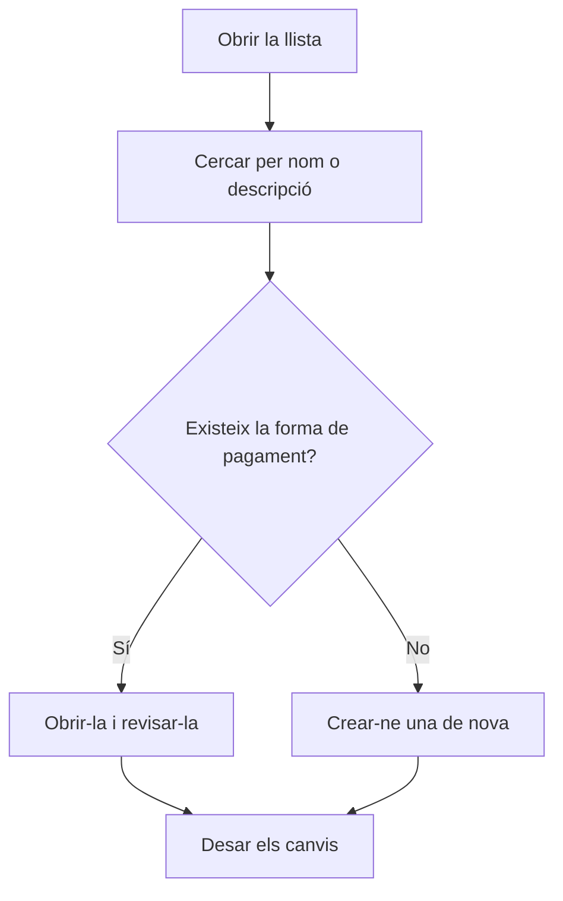

# Formes de pagament

## Per a que serveix aquesta pantalla

Llista les formes de pagament que s'assignen a clients, proveïdors i factures. Cada forma de pagament decideix com es calculen els venciments d'una factura: quants pagaments hi ha, a quants dies i en quin dia del mes. Des d'aquí en consultes la configuració d'un cop d'ull i en crees de noves. El significat de cada camp s'explica a l'ajuda de la fitxa «Forma de pagament».

## Accions disponibles

- Cercar per nom o descripció amb el filtre «Cercar». La llista es filtra mentre escrius.
- Esborrar la cerca amb el botó «Netejar filtres».
- Crear una forma de pagament nova amb el botó verd «+» («Crear nou»).
- Obrir una forma de pagament fent clic a la seva fila per consultar-la o modificar-la.

## Flux habitual

1. Obre la llista de formes de pagament.
2. Escriu part del nom o de la descripció a «Cercar» per trobar la que busques.
3. Revisa les columnes «Dies venciment» i «Dia pagament» per veure com venç cada forma de pagament.
4. Si no n'hi ha cap que encaixi, toca «+» per crear-ne una de nova.
5. Omple la fitxa i desa-la; tornaràs a la llista amb el canvi aplicat.

## Aspectes importants

- La llista mostra totes les formes de pagament ordenades per nom, també les desactivades. La columna «Desactivada» indica quines ho estan.
- Aquesta pantalla no permet eliminar formes de pagament. Per deixar d'utilitzar-ne una, obre-la i marca «Desactivada».
- Les formes de pagament desactivades no s'ofereixen en triar la forma de pagament a la fitxa de client ni a les factures de venda i de compra.
- Modificar una forma de pagament no canvia els venciments ja calculats. Els venciments d'una factura de venda es tornen a calcular cada vegada que es desa la factura, i llavors ja fan servir la configuració nova.

## Errors frequents

- Si no trobes una forma de pagament, esborra la cerca amb «Netejar filtres»: el filtre només busca al nom i a la descripció.
- Si una forma de pagament no apareix al selector d'un client o d'una factura, comprova que no estigui marcada com a «Desactivada».
- Si els venciments d'una factura no són els que esperaves, obre la forma de pagament i revisa «Dies venciment», «Dia de pagament», «Número de pagaments» i «Freqüència».

## Proces basic

