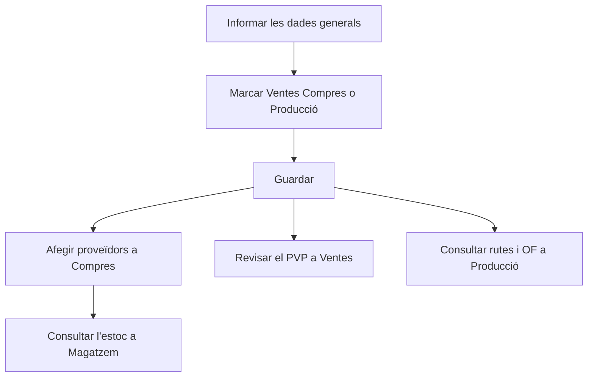

# Referència

## Per a que serveix aquesta pantalla

És la fitxa unificada d'una referència. Reuneix en una sola pantalla el que les fitxes de «Referències de venda» i «Referències de compra» mostren per separat: les dades generals, el preu de venda, els proveïdors i les seves tarifes, les rutes i les ordres de fabricació (OF) i l'estoc per ubicació. Les caselles «Ventes», «Compres» i «Producció» decideixen en quins àmbits s'utilitza la referència i quines pestanyes es mostren.

## Accions disponibles

- **«General»**: informar el «Codi», la «Descripció», la «Versió», el «Tipus de material», el «Format», el «Client», l'«Impost» i el «PVP», marcar les caselles «Activa», «Ventes», «Compres», «Producció», «Servei» i «Requereix lot», i desar amb «Guardar».
- A «General», pujar, consultar i eliminar fitxers a «Documentació» (només quan la referència ja està creada).
- **«Ventes»**: canviar el «PVP» i desar-lo amb «Guardar PVP», i consultar l'«Històric de ventes (albarans)».
- **«Compres»**: consultar el «PUC (últim cost de compra)» i les subpestanyes:
  - «Proveïdors i tarifes»: afegir un proveïdor amb «+», editar-lo amb el llapis o eliminar-lo amb la «X».
  - «Tarifes de serveis externs»: consultar les línies de tarifes de compra dels proveïdors que inclouen aquesta referència.
  - «Tarifes de transport»: consultar les tarifes de transport dels proveïdors assignats.
  - «Històric de compres»: consultar les línies de recepció d'aquesta referència.
- **«Producció»**: consultar les «Rutes de fabricació» i les «Ordres de fabricació (OFs)» de la referència, i obrir-les fent clic a la fila.
- **«Magatzem»**: consultar l'«Estoc per ubicació», amb el magatzem, la ubicació, la quantitat i les mides (ample, llarg, alt, diàmetre i gruix).

## Flux habitual

1. Crea la referència des de «Gestió de referències» o obre'n una d'existent.
2. A «General», informa el codi, la descripció, la versió i l'impost, i marca «Ventes», «Compres» o «Producció» segons l'ús.
3. Desa amb «Guardar». En una referència nova, en aquest moment apareixen les altres pestanyes.
4. Si es compra, ves a «Compres» > «Proveïdors i tarifes» i afegeix els proveïdors amb el seu codi, preu i dies d'entrega.
5. Si es ven, revisa el «PVP» a «Ventes».
6. Si es fabrica, consulta a «Producció» les rutes i les OF, i obre la ruta per revisar-ne els costos.

## Aspectes importants

- **Pestanyes segons l'ús**: «Ventes», «Compres» i «Producció» només surten quan la referència ja està creada i la casella corresponent està marcada; «Magatzem» surt sempre que la referència existeix. Les dades de cada pestanya es carreguen en obrir la fitxa: si marques una casella nova, desa i torna a obrir la referència per veure'n les dades.
- **Categoria**: aquesta pantalla no permet triar la categoria. Les referències noves es creen com a productes; els materials, eines i serveis es donen d'alta a «Referències de compra». Si obres aquí un material existent, conserva la seva categoria.
- **Versions**: la mateixa referència pot tenir diverses versions amb el mateix codi. Les referències de venda es mostren amb el codi seguit de «(v. versió)». Una referència nova comença amb la versió «1».
- **Codi amb tipus**: si la referència és de compra però no de venda i té un «Tipus de material», en desar el programa afegeix el nom del tipus entre parèntesis al final del codi.
- **Costos automàtics**: el «Cost Teòric Fabricació» i el «Cost Última Fabricació / Compra» no es poden editar. El primer s'actualitza cada vegada que es desa una ruta de fabricació de la referència, amb els costos d'aquella ruta; el segon, quan s'actualitza una OF d'aquesta referència o es desa una recepció que la conté. El «PUC (últim cost de compra)» de la pestanya «Compres» mostra aquest mateix valor.
- **Recepcions i proveïdors**: en desar una recepció, el programa actualitza el preu del proveïdor d'aquesta referència i, si el proveïdor no hi era, l'afegeix a «Proveïdors i tarifes». Per als materials, si el «Format» no és el d'unitats, el preu que es desa és per quilo.
- **«Guardar PVP»** desa tota la fitxa, no només el preu: també els canvis pendents de la pestanya «General».
- **Tarifes**: les tarifes de serveis externs i de transport només es consulten aquí. Es mantenen a la fitxa del proveïdor, a les pestanyes «Tarifes de compra» i «Tarifes de transport».
- **Producció**: aquí només es consulten les rutes i les OF. Per crear una ruta de fabricació nova, fes-ho des de la fitxa de la referència a «Referències de venda». El «Cost total OF» suma els costos d'operari, màquina i material.
- **«Requereix lot»**: amb la casella marcada, el programa assigna un lot a les entrades i sortides d'aquesta referència (OF, recepcions i albarans) per a la traçabilitat.
- **Estoc**: la pestanya «Magatzem» és només de consulta. L'estoc el mouen els documents (recepcions, OF i albarans), no aquesta fitxa.
- **Documentació**: els fitxers són els mateixos que es veuen a la fitxa de «Referències de venda».
- **Activar i desactivar**: aquesta pantalla no elimina referències. Per retirar-ne una, desmarca «Activa» i desa.

## Errors frequents

- Si no veus la pestanya «Ventes», «Compres» o «Producció», comprova que la casella corresponent estigui marcada i que la referència estigui desada.
- Si en desar surt un error, comprova que el «Codi», la «Descripció» i la «Versió» estiguin informats. La «Versió» admet com a màxim 10 caràcters i el «Codi», 50.
- Si el codi ha canviat en desar i ara acaba amb un text entre parèntesis, és el «Tipus de material» que s'afegeix a les referències només de compra.
- Si en desar un proveïdor surt «Selecciona un proveïdor», tria'n un al desplegable «Proveïdor».
- Si els històrics o les tarifes surten buits just després de marcar una casella, desa i torna a obrir la referència.
- Si «Tarifes de transport» surt buit, comprova que la referència tingui proveïdors a «Proveïdors i tarifes» i que aquests proveïdors tinguin tarifes de transport.

## Proces basic

