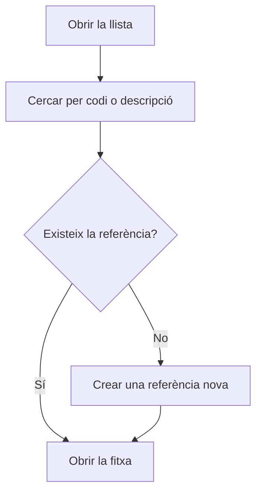

# Gestió de referències

## Per a que serveix aquesta pantalla

Llista totes les referències de l'empresa en un sol lloc, siguin de venda, de compra o de producció. A diferència de «Referències de venda» i «Referències de compra», que mostren només la seva part, aquí es veuen totes juntes i s'obre una fitxa unificada amb pestanyes per a vendes, compres, producció i magatzem.

## Accions disponibles

- Cercar per codi o descripció amb el camp «Cercar...».
- Esborrar la cerca amb el botó «Netejar filtres».
- Ordenar per «Codi» o per «Descripció» fent clic a la capçalera de la columna.
- Consultar a les columnes «Ventes», «Compres» i «Producció» en quins àmbits s'utilitza cada referència, i a «Activa» si està activa.
- Crear una referència nova amb el botó «+» («Crear nou»).
- Obrir una referència fent clic a la fila.

## Flux habitual

1. Escriu part del codi o de la descripció a «Cercar...».
2. Revisa la «Versió» i les columnes «Ventes», «Compres» i «Producció» per trobar la referència correcta.
3. Fes clic a la fila per obrir-ne la fitxa.
4. Si no existeix, crea-la amb el botó «+» i informa les dades generals.

## Aspectes importants

- La llista inclou referències de totes les categories: productes, materials, eines i serveis.
- La cerca només mira el codi i la descripció, i no distingeix majúscules i minúscules.
- Una mateixa referència pot tenir diverses versions: cada versió surt en una fila pròpia amb el mateix codi.
- Des d'aquesta llista no es poden eliminar referències. Per retirar-ne una, desmarca «Activa» a la fitxa; la referència continua a la llista amb «Activa» sense marcar.
- Les referències noves que es creen des d'aquí són productes. Per donar d'alta materials, eines o serveis de compra, fes servir «Referències de compra».

## Errors frequents

- Si no trobes una referència, esborra la cerca i prova amb una part més curta del codi o de la descripció.
- Si veus dues files amb el mateix codi, comprova la columna «Versió»: són versions diferents de la mateixa referència.
- Si una referència surt amb un sufix entre parèntesis al codi, és el tipus de material que el programa afegeix a les referències només de compra.

## Proces basic

