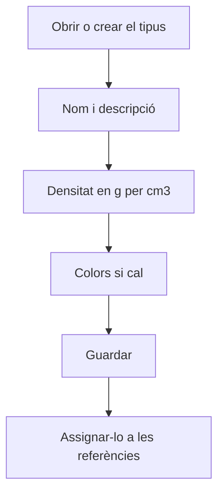

# Tipus de material

## Per a que serveix aquesta pantalla

És la fitxa d'un tipus de material. Hi defineixes el nom, la descripció i, sobretot, la densitat del material. Les referències de matèria primera que tenen aquest tipus al camp «Tipus de material» fan servir aquesta densitat per convertir mides en pes, i del pes en surten preus i costos.

## Accions disponibles

- Omplir «Nom» i «Descripció».
- Indicar la «Densitat g/cm^3» del material.
- Triar un «Color Primari» i un «Color Secundari» amb el selector de color.
- Marcar «Desactivat».
- Desar amb «Guardar», a la capçalera. En desar, tornes a la pantalla anterior.

## Flux habitual

1. Des de «Tipus de matèries primes», toca «+» o obre el tipus que vols revisar.
2. Escriu el nom i la descripció, per exemple «INOX» i «Acer inoxidable».
3. Escriu la densitat en g/cm³, per exemple 7.93.
4. Si cal, tria els colors.
5. Toca «Guardar».

## Aspectes importants

- «Nom» i «Descripció» són obligatoris i admeten fins a 250 caràcters. Al selector «Tipus de material» de les referències, el tipus es mostra com a «nom - descripció».
- La densitat s'escriu en g/cm³ i amb punt decimal. Les mides s'introdueixen en mil·límetres i, amb la densitat en aquesta unitat, el pes surt en quilos.
- A les línies d'«Albarans de compra» de material, el pes unitari es calcula amb les mides de la línia, el format de la referència (placa, rodó o tub) i la densitat. El preu de la línia és el preu per quilo multiplicat pel pes.
- Als pressupostos, el pes de cada línia es calcula amb la densitat i el volum de la ruta de fabricació.
- El cost real de material de les ordres de fabricació també es calcula amb el pes quan la referència té format de placa, rodó o tub.
- Si canvies la densitat, els càlculs que es facin a partir d'aquell moment faran servir el valor nou; els pesos ja calculats no canvien.

## Errors frequents

- Si en calcular el pes d'una línia d'albarà de compra surt «Referencia sense tipus», assigna un tipus de material a la referència.
- Si surt un avís que les mides i la densitat han de ser superiors a 0, comprova que la densitat del tipus no sigui 0 i que la línia tingui totes les mides.
- Si els pesos surten mil vegades més grans o més petits, revisa que la densitat estigui en g/cm³ (per exemple 7.85 per a l'acer, no 7850).

## Proces basic

