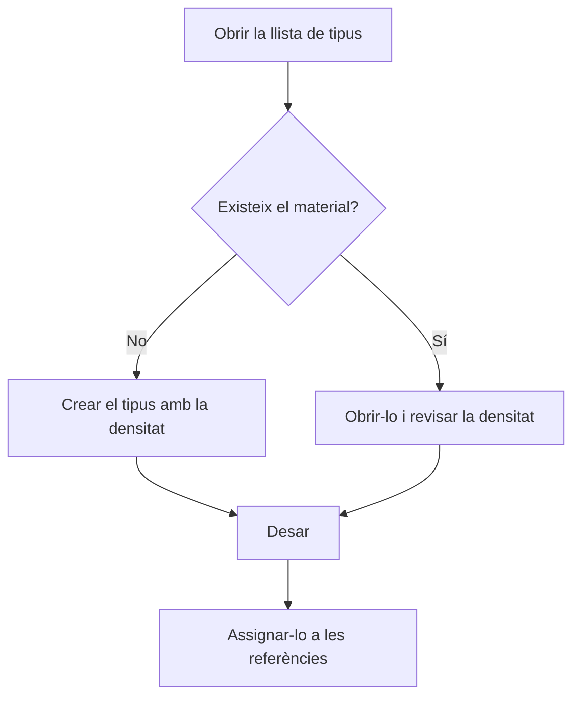

# Tipus de matèries primes

## Per a que serveix aquesta pantalla

Llista els tipus de material (per exemple, acer, alumini o llautó) amb què es classifiquen les referències de matèria primera. Cada tipus guarda la densitat del material, que el programa fa servir per calcular pesos a partir de les mides: a les línies d'albarans de compra, als pressupostos i al cost de material de les ordres de fabricació. El tipus s'assigna a cada referència al camp «Tipus de material» de la seva fitxa.

## Accions disponibles

- Consultar el nom, la descripció, la densitat i si el tipus està «Desactivada».
- Ordenar la llista per «Nom» o per «Descripció» tocant la capçalera de la columna. Per defecte s'ordena per nom.
- Crear un tipus nou amb el botó verd «+» («Crear nou»).
- Obrir un tipus fent clic a la seva fila per modificar-lo.
- Eliminar un tipus amb la icona de la paperera de la fila, i confirmar-ho.

## Flux habitual

1. Obre la llista de tipus de materials.
2. Comprova si ja existeix el material que necessites.
3. Si no hi és, toca «+» i crea'l amb la seva densitat.
4. Desa'l; tornaràs a la llista amb el tipus nou.
5. Assigna el tipus a les referències des del camp «Tipus de material» de la fitxa de referència.

## Aspectes importants

- La densitat es desa en g/cm³, la mateixa unitat que mostra la fitxa del tipus, encara que la capçalera de la columna indiqui una altra unitat.
- L'eliminació és definitiva. No es pot eliminar un tipus que està assignat a alguna referència: primer cal canviar-lo a les referències.
- Marcar un tipus com a desactivat no l'amaga del selector «Tipus de material» de les referències.
- En eliminar-lo correctament, surt l'avís «Eliminat» i la llista es torna a carregar.

## Errors frequents

- Si no pots eliminar un tipus, comprova si alguna referència el té assignat al camp «Tipus de material» i canvia-l'hi abans.
- Si el pes calculat d'un material és incorrecte, obre el tipus de la referència i revisa'n la densitat.

## Proces basic

