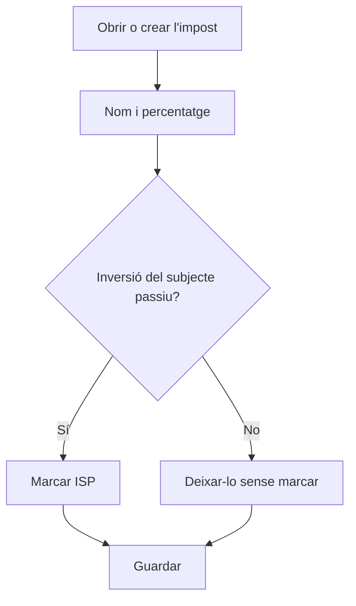

# Impost

## Per a que serveix aquesta pantalla

És la fitxa d'un impost. Hi defineixes el nom, el percentatge i si és d'inversió del subjecte passiu. Aquest impost és el que després es tria a les línies de les factures de venda, als imports de les factures de compra i a la fitxa de les referències, i determina la quota d'impost de cada factura.

## Accions disponibles

- Omplir «Nom» i «Percentatge».
- Marcar «Inversió del subjecte passiu (ISP)» per als impostos en què la quota no es cobra a la factura.
- Marcar «Desactivada» perquè deixi d'oferir-se a les factures.
- Desar amb «Guardar», a la capçalera. En desar, tornes a la pantalla anterior.

## Flux habitual

1. Des de «Impostos», toca «+» o obre l'impost que vols revisar.
2. Escriu un nom clar, per exemple «IVA 21%».
3. Indica el percentatge.
4. Si és un impost d'inversió del subjecte passiu, marca «Inversió del subjecte passiu (ISP)».
5. Toca «Guardar».

## Aspectes importants

- «Nom» i «Percentatge» són obligatoris. El nom admet fins a 250 caràcters. Els decimals del percentatge s'escriuen amb punt.
- La quota d'impost és la base multiplicada pel percentatge i dividida per 100.
- Si l'impost és d'inversió del subjecte passiu, la quota sempre és 0, sigui quin sigui el percentatge. A Verifactu, aquestes línies es declaren com a inversió del subjecte passiu, amb quota 0.
- A les factures de venda, els imports s'agrupen per impost: cada impost diferent de les línies genera una base i una quota pròpies.
- Les factures guarden quin impost té cada línia, no una còpia del percentatge. Si canvies el percentatge d'un impost ja utilitzat i es tornen a calcular els imports d'una factura antiga, s'hi aplicarà el percentatge nou. Si el tipus canvia, és millor crear un impost nou i desactivar l'antic.
- Un impost desactivat no s'ofereix a les línies de les factures de venda ni als imports de les factures de compra.
- En facturar un albarà, les línies de referències sense impost prenen l'impost del 21 %.

## Errors frequents

- Si en desar surt «El percentatge és obligatori», escriu un número al camp «Percentatge», encara que sigui 0.
- Si una factura amb aquest impost mostra quota 0, comprova si està marcat «Inversió del subjecte passiu (ISP)».
- Si en importar una factura de compra no es reconeix l'impost, comprova que hi hagi un impost amb el mateix percentatge que la factura i que no n'hi hagi dos d'iguals.

## Proces basic

