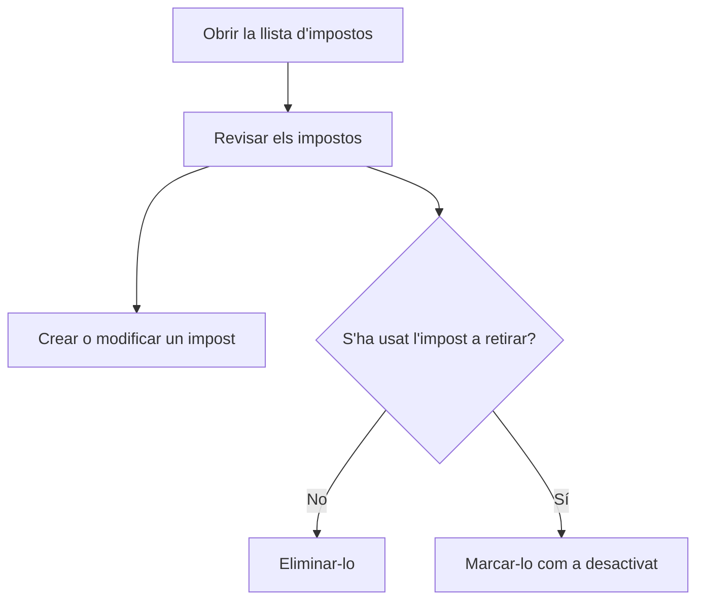

# Impostos

## Per a que serveix aquesta pantalla

Llista els impostos (per exemple, l'IVA al 21 %) que s'apliquen a les línies de les factures de venda, als imports de les factures de compra i a les referències. Cada impost té un percentatge i pot ser d'inversió del subjecte passiu. Des d'aquí en crees de nous, els obres per modificar-los i elimines els que no s'han fet servir mai.

## Accions disponibles

- Consultar el nom, el «% Percentatge», si és d'«Inversió subjecte passiu» i si està «Desactivada».
- Crear un impost nou amb el botó verd «+» («Crear nou»).
- Obrir un impost fent clic a la seva fila per modificar-lo.
- Eliminar un impost amb la icona de la paperera de la fila, i confirmar-ho.

## Flux habitual

1. Obre la llista d'impostos.
2. Comprova que hi hagi els impostos que necessites, com a mínim l'IVA al 21 %.
3. Toca «+» per crear-ne un de nou, o obre'n un per canviar-lo.
4. Omple la fitxa i desa-la; tornaràs a la llista amb el canvi aplicat.
5. Per deixar d'usar un impost que ja té moviments, obre'l i marca «Desactivada» en lloc d'eliminar-lo.

## Aspectes importants

- L'eliminació és definitiva. No es pot eliminar un impost que alguna referència té assignat ni un impost que ja s'ha fet servir en factures de venda o de compra: per deixar de fer-lo servir, marca'l com a «Desactivada».
- Els impostos desactivats no s'ofereixen a les línies de les factures de venda ni als imports de les factures de compra, però continuen apareixent al selector «Impost» de la fitxa de referència.
- En facturar un albarà, cada línia pren l'impost de la seva referència. Si la referència no en té, s'aplica l'impost del 21 %, de manera que cal que n'existeixi un.
- En importar una factura de compra des d'un PDF, els impostos es reconeixen pel percentatge. Evita tenir dos impostos amb el mateix percentatge; si n'hi ha dos al mateix percentatge i un és d'inversió del subjecte passiu, es tria l'altre.
- La llista es torna a carregar quan hi tornes des de la fitxa d'un impost.

## Errors frequents

- Si en eliminar surt «No s'ha pogut eliminar l'impost», l'impost està en ús en alguna referència o factura: desactiva'l en lloc d'eliminar-lo.
- Si en facturar un albarà surt «No existeix l'impost IVA 21%», crea un impost amb percentatge 21.
- Si un impost no apareix en una factura, comprova que no estigui marcat com a «Desactivada».

## Proces basic

