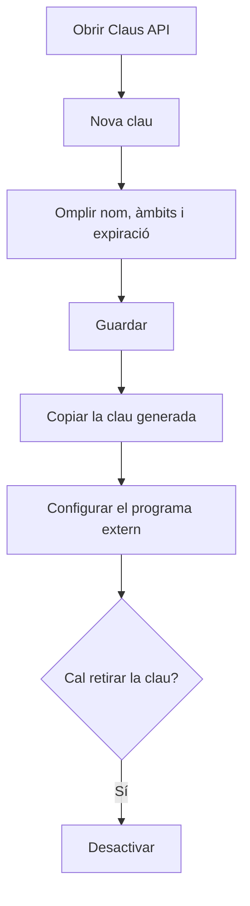

# Claus API

## Per a que serveix aquesta pantalla

Aquí es creen i es desactiven les claus que fan servir altres programes (integracions, scripts, serveis externs) per connectar-se a l'ERP sense usuari ni contrasenya. Cada clau s'identifica pel nom i pel prefix, i pot tenir data d'expiració. La clau completa només es mostra una vegada, en el moment de crear-la.

## Accions disponibles

- Consultar les claus existents amb el nom, la descripció, el «Prefix», els «Àmbits», la data a «Expira» i l'«Estat» («Activa» o «Inactiva»).
- Crear una clau amb «Nova clau»: s'obre el diàleg «Nova clau API» amb «Nom», «Descripció», «Àmbits (scopes)» i «Data d'expiració», i es desa amb «Guardar».
- Copiar la clau generada amb el botó de copiar del diàleg «Clau API generada».
- Desactivar una clau amb el botó «Desactivar» de la fila i confirmar-ho al missatge «Desactivar clau API».

## Flux habitual

1. Toca «Nova clau».
2. Escriu un «Nom» que identifiqui clarament qui farà servir la clau (per exemple, el nom de la integració) i, si cal, una «Descripció».
3. Omple els «Àmbits (scopes)» només si la integració els necessita i, si vols que caduqui, tria la «Data d'expiració».
4. Toca «Guardar».
5. Al diàleg «Clau API generada», copia la clau i desa-la en un lloc segur.
6. Toca «He guardat la clau» i configura la clau al programa extern.
7. Quan la integració ja no s'hagi de fer servir, o si la clau s'ha filtrat, desactiva-la.

## Aspectes importants

- La clau completa només es veu al diàleg «Clau API generada». L'ERP no la guarda en clar: un cop tancat el diàleg no es pot tornar a consultar. Si es perd, cal crear-ne una de nova i desactivar l'antiga.
- La clau comença per «rs_» seguit del prefix que surt a la columna «Prefix». Així pots saber quina clau fa servir cada programa sense veure-la sencera.
- El programa extern ha d'enviar la clau a cada petició a l'API, a la capçalera «X-Api-Key».
- Tracta la clau com una contrasenya. Una clau activa dona accés a l'API encara que no tingui cap àmbit.
- Els àmbits s'escriuen separats per comes. Actualment l'únic àmbit que el sistema té en compte és «branding.write», que permet modificar el «Branding». La resta d'àmbits es guarden però no limiten l'accés.
- Si no poses data d'expiració, la clau no caduca mai (a la llista surt «Mai»). Si en poses una, la clau deixa de funcionar quan arriba aquesta data.
- L'«Estat» només indica si la clau s'ha desactivat. Una clau caducada continua sortint com a «Activa», però ja no permet connectar-se: mira també la columna «Expira».
- Desactivar és definitiu: una clau «Inactiva» no es pot tornar a activar ni editar. Les claus no s'esborren; queden a la llista com a «Inactiva».
- Un cop creada, una clau no es pot modificar (ni el nom, ni els àmbits, ni la data d'expiració). Per canviar-ne res, crea'n una de nova i desactiva l'anterior.

## Errors frequents

- Si en desar surt «Error en crear la clau API», comprova primer que no hi hagi ja una clau amb el mateix nom, encara que estigui inactiva: els noms no es poden repetir.
- Si el diàleg no deixa desar, revisa que el «Nom» estigui omplert («El nom és obligatori»).
- Si un programa extern deixa de connectar-se, comprova a la llista que la clau no estigui «Inactiva» i que la data d'«Expira» no hagi passat.
- Si has tancat el diàleg sense copiar la clau, no la podràs recuperar: crea'n una de nova i desactiva la que no has pogut desar.

## Proces basic

