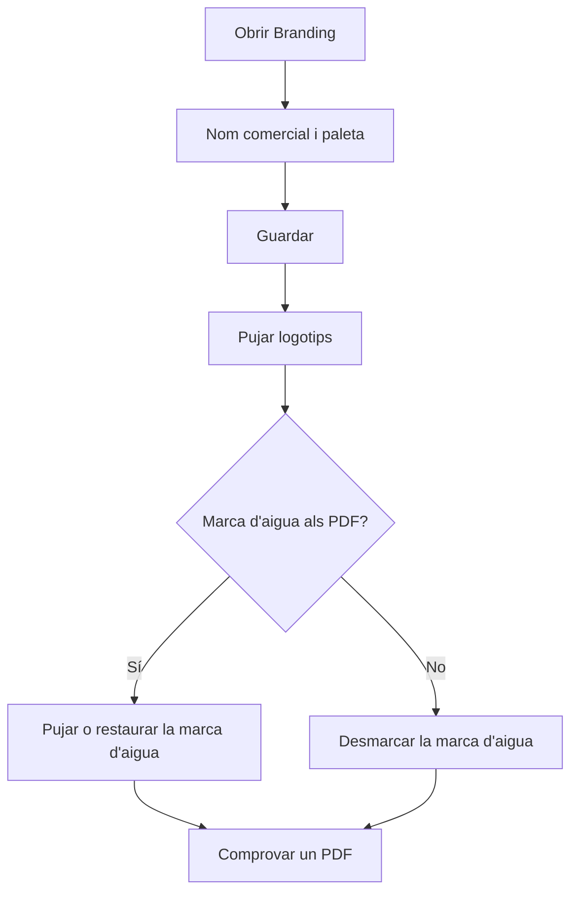

# Branding

## Per a que serveix aquesta pantalla

Aquí es configura la imatge de l'empresa a l'aplicació i als documents PDF: el nom comercial, la paleta de color, els logotips i la marca d'aigua. Els canvis afecten tots els usuaris: la barra lateral, la pantalla d'inici de sessió, la pantalla d'inici i els PDF de pressupostos, comandes, albarans, factures i ordres de fabricació. Només els administradors poden fer canvis; la resta d'usuaris veuen la configuració en mode de consulta.

## Accions disponibles

- Canviar el «Nom comercial» i la «Paleta de color» (Negre, Blau, Indi, Maragda, Turquesa, Violeta, Taronja o Rosa) i desar-ho amb «Guardar», a la capçalera.
- Pujar el «Logotip principal» amb «Seleccionar», o treure'l amb «Eliminar».
- Pujar el «Logotip de la barra lateral» amb «Seleccionar», o treure'l amb «Eliminar».
- Activar o desactivar «Mostrar la marca d'aigua» a l'apartat «Documents PDF».
- Pujar una marca d'aigua pròpia amb «Seleccionar», o tornar a la de fàbrica amb «Restaurar la predeterminada».

## Flux habitual

1. Obre «Branding».
2. Escriu el «Nom comercial» i tria la «Paleta de color».
3. Toca «Guardar» a la capçalera.
4. Puja el «Logotip principal» i, si el logotip no es llegeix bé sobre el fons fosc de la barra lateral, puja també un «Logotip de la barra lateral».
5. A «Documents PDF», decideix si vols «Mostrar la marca d'aigua» i, si cal, puja la teva.
6. Genera un PDF (per exemple, un pressupost) per comprovar-ne el resultat.

## Aspectes importants

- Els logotips i la marca d'aigua es desen al moment de triar el fitxer, i la casella «Mostrar la marca d'aigua» es desa en marcar-la o desmarcar-la. Només el nom comercial i la paleta necessiten «Guardar».
- Formats admesos: PNG, JPG/JPEG i WebP, de 2 MB com a màxim. L'extensió del fitxer ha de correspondre al seu contingut real. La marca d'aigua només admet PNG o WebP amb fons transparent.
- El «Nom comercial» pot tenir fins a 60 caràcters. Si el deixes buit, es fa servir el nom per defecte. Surt a la barra lateral, a la pestanya del navegador, a les pantalles d'inici de sessió i d'inici, i com a autor dels PDF.
- La paleta canvia el color principal de tota l'aplicació (botons i elements destacats) i els detalls de color dels PDF (títol, línies i capçaleres de taula). Tu ho veus a l'instant; la resta d'usuaris, quan tornin a carregar l'aplicació.
- El «Logotip principal» surt a la pantalla d'inici de sessió, a la pantalla d'inici i a tots els PDF. Sense logotip propi es fa servir el de fàbrica.
- El «Logotip de la barra lateral» es mostra sobre fons fosc. Si no n'hi ha, la barra lateral fa servir el logotip principal i, si tampoc n'hi ha, el de fàbrica.
- La marca d'aigua s'imprimeix al centre de la pàgina, per sobre del contingut, als pressupostos, comandes de venda, albarans, factures de venda i comandes de compra. Les ordres de fabricació no en porten. Per això ha de tenir fons transparent: una imatge opaca (per exemple, un JPG) es rebutja perquè taparia el text.
- Amb «Mostrar la marca d'aigua» desmarcada, els PDF no porten cap marca d'aigua i no se'n pot pujar cap de nova. Marcada i sense imatge pròpia, s'imprimeix la «Marca d'aigua per defecte».
- En substituir o eliminar un logotip o la marca d'aigua, el fitxer anterior s'esborra del servidor i no es pot recuperar. Guarda'n una còpia abans si el vols conservar.
- La configuració és de l'empresa activa. Si a «Empreses» n'hi ha més d'una d'activa, l'aplicació mostra la imatge per defecte i els canvis no es poden desar.

## Errors frequents

- Si surt «No tens permisos per modificar el Branding.», cal un usuari administrador per fer canvis.
- Si surt «El logotip no pot superar els 2 MB», redueix la mida de la imatge; passa també amb la marca d'aigua.
- Si en pujar una imatge es rebutja, el missatge n'explica el motiu: comprova que sigui PNG, JPG o WebP, que l'extensió coincideixi amb el format real (per exemple, un PNG reanomenat a .jpg es rebutja) i, per a la marca d'aigua, que tingui fons transparent.
- Si en desar també surt «No s'ha pogut actualitzar el Branding.», comprova a «Empreses» que només n'hi hagi una d'activa.
- Si no pots triar una marca d'aigua, marca abans «Mostrar la marca d'aigua».
- Si un altre usuari encara veu els colors antics, ha de tornar a carregar l'aplicació.

## Proces basic

