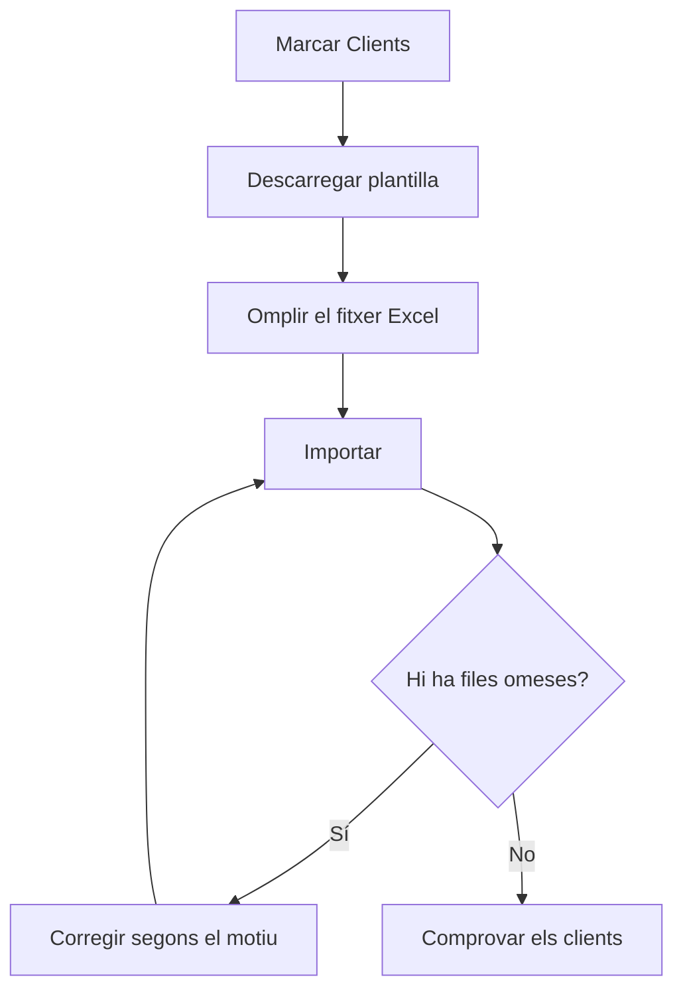

# Importació / Exportació de dades

## Per a que serveix aquesta pantalla

Serveix per carregar dades de cop des d'un fitxer Excel, per exemple en posar en marxa l'ERP amb les dades d'un programa anterior, i per exportar a Excel les dades que ja hi ha. Ara mateix l'única entitat disponible és «Clients», amb les seves adreces i contactes, i també els tipus de client i les formes de pagament. Pantalla reservada als administradors.

## Accions disponibles

- Triar les entitats a «Entitats disponibles», una a una o amb «Selecciona-ho tot». Cal triar-ne almenys una abans de qualsevol acció.
- Descarregar un Excel buit amb les columnes que cal omplir amb «Descarregar plantilla».
- Pujar un Excel omplert amb «Importar».
- Descarregar a Excel les dades existents amb «Exportar».
- Revisar el «Resultat de la importació»: «Total», «Inserits», «Omesos» i la llista de files amb problemes («Full», «Fila», «Codi» i «Motiu»).

## Flux habitual

1. Marca «Clients» a «Entitats disponibles».
2. Toca «Descarregar plantilla». Cada columna porta un comentari que indica el tipus de dada, si és obligatòria, a quina altra dada fa referència i el valor per defecte.
3. Omple els fulls: primer els tipus de client i les formes de pagament que no existeixin, després els clients, les seves adreces i els contactes.
4. Toca «Importar» i tria el fitxer .xlsx.
5. Revisa el «Resultat de la importació». Si hi ha files omeses, corregeix-les al fitxer segons el «Motiu».
6. Torna a importar el fitxer: les files que ja s'havien importat s'ometran i només entraran les corregides.
7. Comprova els clients nous a la pantalla de clients.

## Aspectes importants

- La importació només afegeix registres nous. No modifica ni esborra cap dada existent: si un client ja existeix, la fila s'omet i el client de l'ERP queda igual.
- Els noms dels fulls i de les columnes (en anglès) s'han de mantenir tal com surten a la plantilla: «Customer», «CustomerAddress», «CustomerContact», «CustomerType» i «PaymentMethod». El full «Customer» és obligatori; els altres són opcionals.
- Un client s'omet si el seu codi o el seu nom comercial ja existeixen a l'ERP o es repeteixen dins del fitxer (sense distingir majúscules).
- Per a cada client són obligatoris el codi, el nom comercial, el nom fiscal, el NIF/CIF, el número de compte i el tipus de client. El NIF/CIF ha de ser un NIF, NIE o CIF espanyol vàlid. La forma de pagament és opcional, però si s'indica ha d'existir. L'idioma preferit, si es deixa buit, és el català.
- El tipus de client i la forma de pagament es busquen pel nom, entre els que ja hi ha a l'ERP i els dels fulls «CustomerType» i «PaymentMethod» del mateix fitxer.
- Cada client necessita almenys una adreça al full «CustomerAddress». L'adreça marcada com a principal (o, si no n'hi ha cap, la primera) ha de tenir país, codi postal, ciutat i adreça; si no, el client s'omet.
- Les adreces i els contactes s'enllacen amb el client pel codi, i només s'afegeixen a clients nous del mateix fitxer. Un contacte es pot lligar a una adreça pel nom de l'adreça.
- Les columnes sí/no accepten «true» o «1»; qualsevol altre valor es llegeix com a «no». Els decimals admeten coma o punt.
- Els tipus de client i les formes de pagament nous es desen abans que els clients: es creen encara que després algun client quedi omès. Els que ja existeixen amb el mateix nom no es modifiquen.
- A «Omesos» també es compten les files de tipus de client i formes de pagament que ja existien, encara que no surtin a la llista de problemes.
- «Exportar» inclou els clients amb les adreces i els contactes actius, i els tipus de client i les formes de pagament actius, amb el mateix format que la plantilla.

## Errors frequents

- Si surt «Selecciona almenys una entitat.», marca «Clients» abans de tocar el botó.
- Si al resultat surt «Falta el full obligatori Customer», comprova que el fitxer tingui el full «Customer» amb aquest nom exacte.
- Si surt «Ja existeix un client amb el codi …» o «Ja existeix un client amb el nom comercial …», el client ja és a l'ERP o està repetit al fitxer; canvia'l a mà a la fitxa del client, perquè la importació no el modifica.
- Si surt «NIF/CIF invàlid», revisa el NIF/CIF: ha de ser un identificador fiscal espanyol vàlid.
- Si surt «El tipus de client … no existeix» o «La forma de pagament … no existeix», afegeix-los al full corresponent o revisa que el nom sigui exactament el mateix.
- Si una adreça o un contacte surt amb «El client … no s'ha trobat entre els clients importats», primer corregeix la fila del client, que s'ha omès o no és al fitxer.
- Si surt «La direcció fiscal principal del client és incompleta», omple país, codi postal, ciutat i adreça a l'adreça principal.
- Si surt «No s'ha pogut importar el fitxer.», comprova que sigui un .xlsx vàlid. Si el fitxer és gran, pot ser que la importació s'hagi fet igualment: revisa els clients abans de tornar-ho a provar.

## Proces basic

