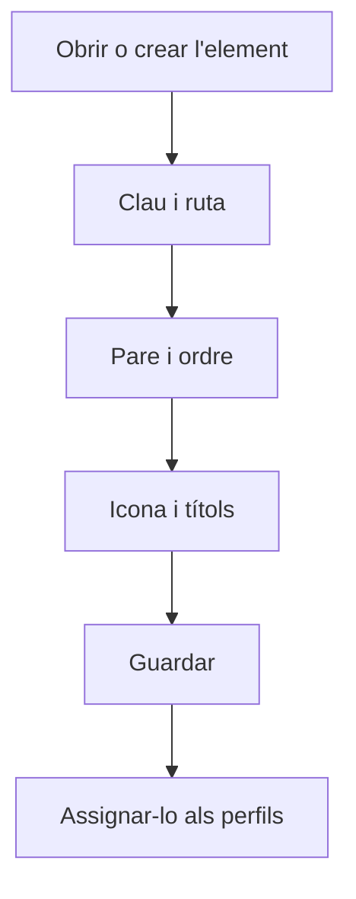

# Element de menú

## Per a que serveix aquesta pantalla

És la fitxa d'un element del menú lateral: pot ser un grup que agrupa altres opcions o una opció que obre una pantalla. Aquí es defineixen la clau, la pantalla que obre, la posició dins del menú, la icona i el títol en cada idioma actiu. Perquè algú el vegi, després cal assignar-lo a un perfil a «Perfils». La pantalla està reservada als administradors.

## Accions disponibles

- Omplir la «Clau», la «Ruta», l'«Ordre» i el «Pare» de l'element.
- Triar la icona amb el selector del camp «Icona».
- Escriure el títol en cada idioma actiu als camps «Títol (...)», un per idioma.
- Desar amb «Guardar», a la capçalera.

## Flux habitual

1. Des de «Elements de menú», obre l'element o crea'n un de nou.
2. Escriu una «Clau» única que identifiqui l'element.
3. Si ha d'obrir una pantalla, escriu-ne la «Ruta», per exemple `/users`. Si és un grup, deixa-la buida.
4. Tria el «Pare», és a dir, el grup on ha d'anar, i l'«Ordre» dins d'aquest grup.
5. Tria la «Icona» i escriu el títol en tots els idiomes.
6. Toca «Guardar» i assigna l'element als perfils a «Perfils».

## Aspectes importants

- La «Clau» és obligatòria i no es pot repetir en cap altre element.
- Cal un títol per a cada idioma actiu. Si no s'han pogut carregar els idiomes, surt l'avís «No s'han pogut carregar els idiomes actius» i no es pot desar.
- Cada usuari veu el títol en el seu idioma.
- L'«Ordre» és obligatori, no pot ser negatiu i marca la posició dins del grup, de menor a major.
- Si no tries cap «Pare», l'element surt al primer nivell del menú. A la llista de pares, cada nivell es marca amb «>».
- Com a «Pare» no es pot triar el mateix element ni cap element que en pengi.
- Els canvis es veuen al menú lateral quan es recarrega la pàgina, i només per als usuaris amb un perfil que tingui l'element assignat.

## Errors frequents

- Si en desar surt que la clau de l'element de menú ja existeix, canvia la «Clau» per una que no faci servir cap altre element.
- Si surt «El títol és obligatori» o «Cal informar un títol per a cadascun dels idiomes actius», omple tots els camps «Títol (...)».
- Si en tornar a obrir l'element els canvis no s'han desat, comprova primer que la «Clau» no la faci servir cap altre element i que el «Pare» no sigui un element que penja d'aquest.
- Si l'element no surt al menú, comprova que estigui assignat al perfil de l'usuari a «Perfils» i recarrega la pàgina.

## Proces basic

