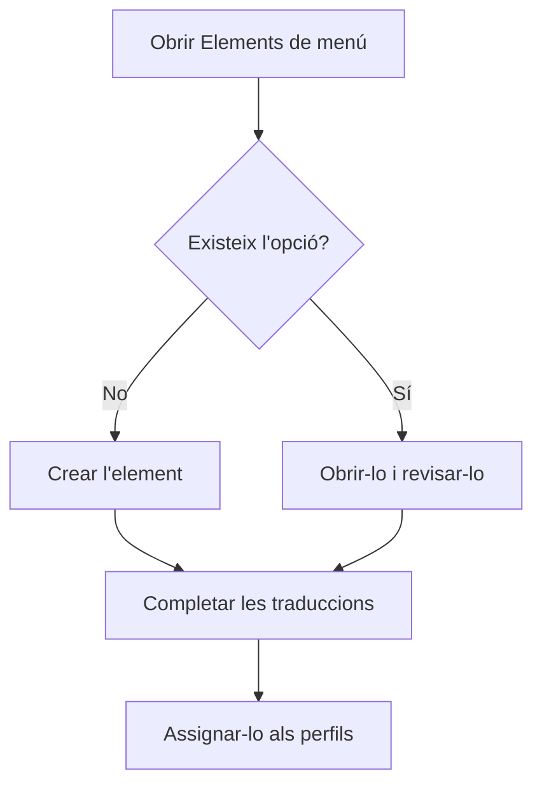

# Elements de menú

## Per a que serveix aquesta pantalla

Aquí es defineix el menú lateral de l'aplicació: els grups, les opcions de cada grup, el seu ordre, la icona, la pantalla que obren i el títol en cada idioma. Els elements que es creen aquí no els veu ningú fins que s'assignen a un perfil a «Perfils». La pantalla està reservada als administradors.

## Accions disponibles

- Consultar els elements en forma d'arbre, amb les columnes «Títol», «Clau», «Ruta», «Ordre» i «Icona». La fletxa de cada grup en mostra o n'amaga els fills.
- Buscar amb el camp «Cercar», que filtra pel títol i per la clau i manté visibles els grups que contenen un resultat. El botó «Netejar filtres» esborra la cerca.
- Crear un element amb el botó verd «+» (indicació «Crear nou»).
- Obrir un element fent clic a la seva fila o amb el botó del llapis de la columna «Accions».
- Eliminar un element amb el botó de la paperera. L'aplicació demana confirmació: «Eliminar element de menú?».
- Traduir els títols de tots els elements alhora amb el botó «Traduir menús».
- Exportar tots els elements a un fitxer JSON amb «Exportar menús», i carregar-ne un amb «Importar menús».

## Flux habitual

1. Busca si l'opció que necessites ja existeix.
2. Si no, toca «+» i crea l'element dins del grup que toca.
3. Revisa a l'arbre que surti al lloc i en l'ordre correctes.
4. Si cal, completa les traduccions amb «Traduir menús».
5. Assigna l'element als perfils que l'han de veure a «Perfils».

## Aspectes importants

- L'ordre dins de cada grup el marca la columna «Ordre», de menor a major.
- Un element que té fills no es pot eliminar: primer cal eliminar els fills o moure'ls a un altre pare.
- L'eliminació és definitiva i treu l'element de tots els perfils que el tenien.
- A «Traduir menús» es veu una fila per element i una columna per idioma actiu. «Guardar» només s'activa quan hi ha canvis i cap títol modificat no ha quedat buit. Si toques «Cancel·lar» amb canvis pendents, l'aplicació pregunta si els vols descartar.
- L'exportació genera un fitxer amb tots els elements, els seus pares, icones, rutes, ordre i títols. Serveix, per exemple, per copiar el menú a una altra instal·lació.
- En importar, els elements es relacionen per la «Clau»: les claus noves es creen i les existents s'actualitzen. Els elements que no surten al fitxer no s'esborren, i l'assignació als perfils no canvia.
- La importació és de tot o res: si hi ha cap error al fitxer, no s'aplica cap canvi. El fitxer pot fer 5 MB com a màxim.
- En importar, el teu menú lateral s'actualitza sol. Els altres canvis es veuen al menú en recarregar la pàgina.

## Errors frequents

- Si després d'eliminar un element encara surt a l'arbre, comprova primer si té elements fills.
- Si l'exportació falla perquè les traduccions d'un element no coincideixen amb els idiomes actius, completa'n els títols amb «Traduir menús» i torna-ho a provar.
- Si la importació diu que el fitxer no conté un document JSON vàlid, fes servir un fitxer generat amb «Exportar menús».
- Si la importació diu que un element té una clau pare inexistent, afegeix el pare al mateix fitxer o treu-li el pare.
- Si la importació diu que les traduccions no coincideixen amb els idiomes actius, comprova que cada element tingui un títol per a cada idioma actiu.

## Proces basic

