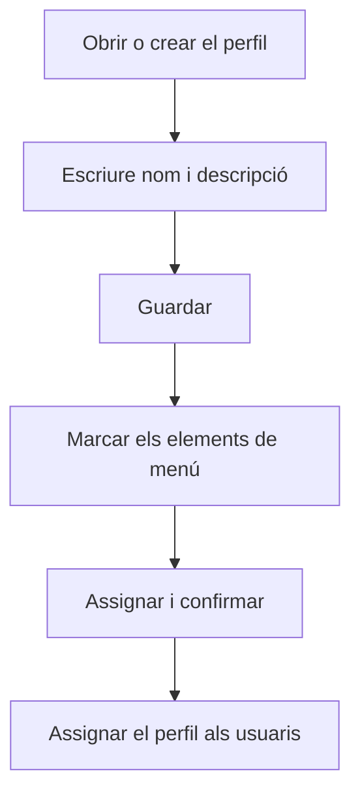

# Perfil

## Per a que serveix aquesta pantalla

És la fitxa d'un perfil. A dalt hi ha el nom i la descripció del perfil; a sota, la llista de tots els elements de menú de l'aplicació, on es marquen els que han de veure els usuaris amb aquest perfil. Els elements de menú es defineixen a «Elements de menú» i el perfil s'assigna a cada usuari a «Gestió d'usuaris». La pantalla està reservada als administradors.

## Accions disponibles

- Escriure o canviar el «Nom» (obligatori) i la «Descripció» del perfil i desar-los amb «Guardar», a la capçalera.
- Buscar elements de menú amb el camp «Cercar», que filtra pel títol i per la clau.
- Marcar o desmarcar elements de menú amb la casella de cada fila, o tots alhora amb la casella de la capçalera de la llista.
- Desar la selecció de menús amb «Assignar». L'aplicació demana confirmació: «Confirmes desar la selecció de menús?».

## Flux habitual

1. Des de «Perfils», obre el perfil o crea'n un de nou.
2. Si és nou, escriu el «Nom» i la «Descripció» i toca «Guardar».
3. A la llista de menús, marca els grups i les opcions que ha de veure aquest perfil. Fes servir «Cercar» per trobar-los més de pressa.
4. Toca «Assignar» i confirma.
5. Assigna el perfil als usuaris a «Gestió d'usuaris».

## Aspectes importants

- La llista mostra els elements de menú en forma d'arbre: cada nivell surt amb més sagnat. Les columnes són «Títol», «Clau», «Ruta» i «Ordre».
- En marcar un element també es marquen tots els seus fills i tots els elements superiors. En desmarcar-lo, es desmarquen els seus fills i els elements superiors que ja no tinguin cap fill marcat.
- La selecció de menús no es desa amb «Guardar»: cal tocar «Assignar». I «Assignar» no desa el nom ni la descripció.
- Primer cal desar el perfil i després assignar-li els menús.
- Si el perfil que modifiques és el teu, el menú lateral s'actualitza en desar la selecció. Els altres usuaris amb aquest perfil veuen el canvi quan recarreguen la pàgina o tornen a iniciar sessió.
- Si el perfil és de sistema, el «Nom» i la casella «Sistema» no es poden modificar.
- La casella «Sistema» no es desa des d'aquesta pantalla: marcar-la no converteix el perfil en perfil de sistema.
- Els elements de menú nous no s'afegeixen sols a cap perfil: cal marcar-los aquí.

## Errors frequents

- Si «Assignar» mostra «Error» en un perfil nou, comprova primer que el perfil estigui desat: torna a «Perfils», obre'l des de la llista i torna a assignar els menús.
- Si en desar un perfil nou surt «Error», torna a «Perfils» i comprova si el perfil ja hi és abans de tornar-lo a crear.
- Si surt un avís de nom de perfil existent, tria un nom que no tingui cap altre perfil.
- Si un usuari no veu una opció que hi hauria de ser, comprova que l'element estigui marcat en el seu perfil i que l'usuari tingui aquest perfil assignat.

## Proces basic

