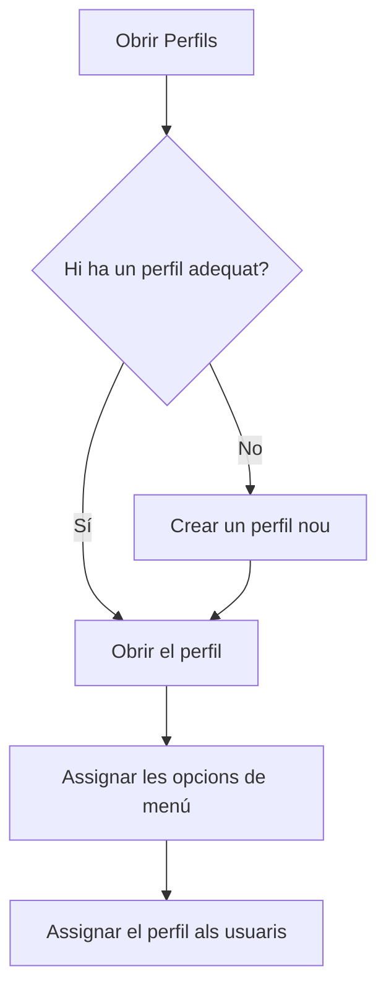

# Perfils

## Per a que serveix aquesta pantalla

Un perfil és el conjunt d'opcions de menú que veu un grup d'usuaris, per exemple «Oficina» o «Planta». Aquí es consulten, es creen i s'eliminen els perfils; les opcions de cada perfil s'assignen a la seva fitxa. Després, a «Gestió d'usuaris», s'assigna un perfil a cada usuari. La pantalla està reservada als administradors.

## Accions disponibles

- Consultar els perfils amb les columnes «Nom», «Descripció» i «Sistema». La columna «Nom» es pot ordenar.
- Crear un perfil nou amb el botó verd «+» (indicació «Crear nou»).
- Obrir un perfil fent clic a la seva fila, per canviar-ne les dades o els menús assignats.
- Eliminar un perfil amb el botó d'eliminar de la seva fila. L'aplicació demana confirmació: «Eliminar perfil?».

## Flux habitual

1. Revisa la llista per veure si ja hi ha un perfil que et serveixi.
2. Si no n'hi ha cap, toca el botó «+», escriu el nom i la descripció i desa'l.
3. Obre el perfil i marca les opcions de menú que ha de veure.
4. Ves a «Gestió d'usuaris» i assigna el perfil als usuaris que calgui.

## Aspectes importants

- Els perfils marcats a la columna «Sistema» no es poden eliminar: la seva fila no té el botó d'eliminar.
- En eliminar un perfil, s'esborra definitivament juntament amb la seva assignació de menús.
- El nom del perfil no es pot repetir.
- El perfil només decideix quines opcions surten al menú lateral. Un usuari sense perfil no veu cap opció al menú.

## Errors frequents

- Si no pots eliminar un perfil, comprova primer que no sigui de sistema i que cap usuari no el tingui assignat. Canvia abans el perfil d'aquests usuaris a «Gestió d'usuaris».
- Si en crear un perfil surt un avís de nom existent, tria un nom que no tingui cap altre perfil.

## Proces basic

