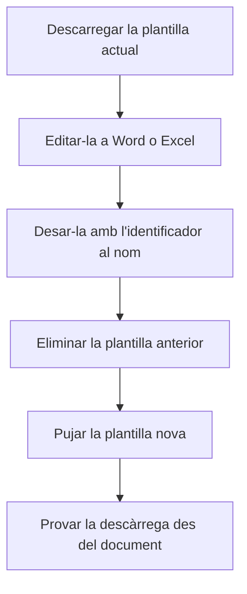

# Gestor d'informes

## Per a que serveix aquesta pantalla

Aquí es guarden les plantilles de Word i d'Excel amb què l'aplicació genera els documents descarregables: pressupostos, comandes de venda, albarans, factures de venda, comandes de compra i ordres de fabricació. Quan en un d'aquests documents tries l'opció de descàrrega en Word o Excel, l'aplicació busca aquí la plantilla que correspon al document i l'omple amb les seves dades. Els PDF no fan servir aquestes plantilles.

## Accions disponibles

- Pujar una plantilla amb el botó de la fletxa cap amunt, a la dreta de la barra «Informes».
- Descarregar una plantilla amb el botó de descàrrega de la seva targeta, per revisar-la o modificar-la.
- Eliminar una plantilla amb el botó de la creu de la seva targeta. L'aplicació demana confirmació: «Segur que vols eliminar el fitxer seleccionat?».
- Veure una imatge o un PDF amb el botó de l'ull. Les plantilles de Word i d'Excel no tenen vista prèvia: només es poden descarregar o eliminar.

## Flux habitual

1. Descarrega la plantilla actual del document que vols canviar, per exemple la de la factura de venda.
2. Fes-hi els canvis a Word o a Excel i desa-la amb un nom que contingui l'identificador del document, per exemple `SalesInvoice.docx`.
3. Elimina la plantilla anterior d'aquest document.
4. Puja la plantilla nova amb el botó de la fletxa cap amunt.
5. Obre una factura de venda, tria «Descarregar» i comprova que el document surt amb el format nou.

## Aspectes importants

- L'aplicació reconeix cada plantilla pel nom del fitxer. El nom ha de contenir un d'aquests identificadors, escrit exactament així (majúscules i minúscules incloses):
  - `Budget`: pressupost, opció «Descarregar».
  - `SalesOrder`: comanda de venda, opcions «Descarregar» i «Descarregar sense preu».
  - `DeliveryNote`: albarà, opcions «Descarregar» i «Descarregar sense preu».
  - `SalesInvoice`: factura de venda, opció «Descarregar», i el botó de descàrrega de «Comptabilització de factures de venda».
  - `PurchaseOrder`: comanda de compra, opció «Descarregar».
  - `WorkOrder`: ordre de fabricació, opció «Descarregar Excel».
- Els documents de venda i de compra es descarreguen en format Word; l'ordre de fabricació, en format Excel.
- Si hi ha més d'un fitxer amb el mateix identificador, l'aplicació en fa servir només un. Deixa una sola plantilla per document.
- Eliminar una plantilla l'esborra definitivament. A partir d'aquell moment, la descàrrega en Word o Excel d'aquest document deixa de funcionar fins que en pugis una altra.
- Les opcions «Imprimir PDF» i «Descarregar PDF» no depenen d'aquesta pantalla. El logotip, els colors i la marca d'aigua dels PDF es configuren a «Branding».
- A la targeta només es veuen els primers 20 caràcters del nom del fitxer.

## Errors frequents

- Si en triar «Descarregar» en un document no es baixa res o surt un error, comprova primer que hi hagi aquí una plantilla amb l'identificador d'aquest document al nom, escrit amb les mateixes majúscules.
- Si el document surt amb un format antic, comprova que no hi hagi dues plantilles amb el mateix identificador i elimina la que sobra.
- Si surt «Error en carregar el fitxer» en pujar una plantilla, torna-ho a provar i comprova que el fitxer no sigui buit.
- Si surt «Error en eliminar el fitxer», torna a obrir la pantalla i comprova si la plantilla encara hi és abans de tornar-ho a provar.

## Proces basic

