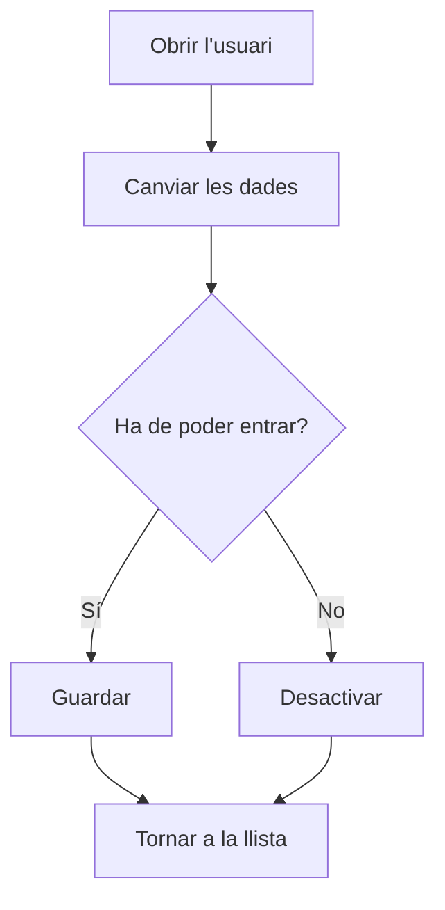

# Usuari

## Per a que serveix aquesta pantalla

És la fitxa d'un usuari. Aquí es canvien el rol, el perfil, el nom, els cognoms i l'idioma, i s'activa o es desactiva l'accés de l'usuari a l'aplicació. Des de la teva pròpia fitxa també pots canviar la teva contrasenya. La pantalla està reservada als administradors.

## Accions disponibles

- Canviar el «Rol», el «Perfil», el «Nom», els «Cognoms» i l'«Idioma» i desar-ho amb «Guardar», a la capçalera.
- Desactivar l'usuari amb «Desactivar», al desplegable del botó «Guardar», perquè no pugui iniciar sessió. Si ja està desactivat, l'opció és «Activar».
- Canviar la teva contrasenya amb «Canviar contrasenya», al mateix desplegable. Només surt a la fitxa de l'usuari amb què has iniciat sessió.

## Flux habitual

1. Obre l'usuari des de «Gestió d'usuaris».
2. Canvia les dades que calgui, per exemple el «Perfil».
3. Toca «Guardar». L'aplicació desa els canvis i torna a la pantalla anterior.
4. Si l'usuari ja no ha d'entrar, obre el desplegable de «Guardar» i tria «Desactivar».

## Aspectes importants

- El «Nom d'usuari» no es pot modificar.
- «Nom» i «Cognoms» són obligatoris, de 250 caràcters com a màxim.
- «Activar» i «Desactivar» desen alhora la resta de canvis del formulari, i només s'apliquen si el formulari és correcte.
- Un usuari desactivat no pot iniciar sessió. Els usuaris no s'eliminen: es desactiven.
- El «Perfil» decideix quines opcions veu l'usuari al menú lateral. El camp només surt si hi ha perfils creats a «Perfils».
- Si canvies l'«Idioma» a la teva pròpia fitxa, l'aplicació canvia d'idioma a l'instant. Per a un altre usuari, el nou idioma s'aplica quan torna a iniciar sessió.
- Els canvis de perfil es veuen quan l'usuari recarrega la pàgina o torna a iniciar sessió; els de rol, quan torna a iniciar sessió.
- Per canviar la contrasenya cal escriure la «Contrasenya actual», la nova «Contrasenya» (almenys 5 caràcters) i repetir-la. Es confirma amb «Modificar».
- No es pot canviar la contrasenya d'un altre usuari des d'aquesta pantalla.

## Errors frequents

- Si en canviar la contrasenya surt «Error al actualitzar la contrasenya», comprova primer que la «Contrasenya actual» sigui correcta.
- Si «Modificar» no fa res, revisa els avisos dels camps: la contrasenya nova ha de tenir almenys 5 caràcters i les dues han de coincidir.
- Si l'usuari diu que no pot entrar, comprova que no estigui desactivat (a la llista, columna «Desactivat»).
- Si l'usuari no veu les opcions esperades al menú, comprova el seu «Perfil» i els menús assignats a aquest perfil a «Perfils».

## Proces basic

