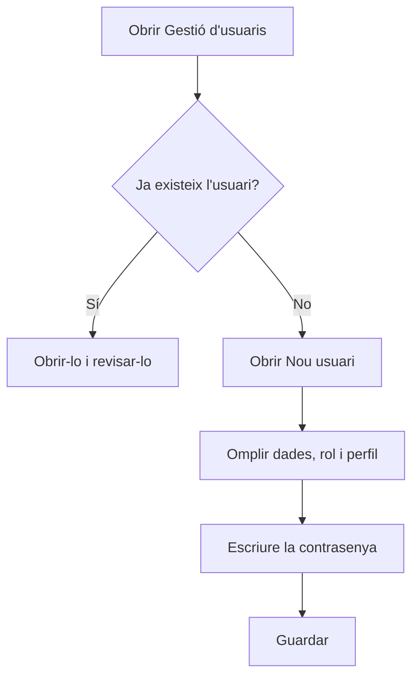

# Gestió d'usuaris

## Per a que serveix aquesta pantalla

Aquí es consulten els usuaris que poden entrar a l'aplicació i se'n creen de nous. Cada usuari té un rol, un idioma i, normalment, un perfil, que decideix quines opcions veu al menú lateral. Els perfils es preparen a «Perfils». La pantalla està reservada als administradors.

## Accions disponibles

- Consultar els usuaris amb les columnes «Nom d'usuari», «Nom», «Cognoms», «Perfil» i «Desactivat». Totes les columnes es poden ordenar.
- Crear un usuari amb el botó verd «+» (indicació «Crear nou»), que obre el diàleg «Nou usuari».
- Obrir un usuari fent clic a la seva fila, per canviar-ne les dades, el perfil o activar-lo i desactivar-lo.

## Flux habitual

1. Comprova a la llista que l'usuari no existeixi ja.
2. Toca el botó «+» per obrir «Nou usuari».
3. Omple «Nom d'usuari», «Nom», «Cognoms», «Correu electrònic», «Rol» i «Idioma».
4. Tria el «Perfil» amb les opcions de menú que ha de veure.
5. Escriu la «Contrasenya» i repeteix-la a «Repetir contrasenya».
6. Toca «Guardar». L'usuari surt a la llista i ja pot iniciar sessió.

## Aspectes importants

- Són obligatoris el nom d'usuari, el nom, els cognoms, el correu electrònic, el rol, l'idioma i la contrasenya. La contrasenya ha de tenir almenys 5 caràcters.
- El nom d'usuari no es pot repetir i, un cop creat l'usuari, ja no es pot canviar.
- El «Perfil» és opcional en crear l'usuari, però un usuari sense perfil no veu cap opció al menú lateral.
- L'usuari es crea actiu. La columna «Desactivat» indica els usuaris que no poden iniciar sessió.
- Els usuaris no s'eliminen: si algú ja no ha d'entrar, obre'l i desactiva'l.
- L'«Idioma» és el que l'aplicació fa servir per a l'usuari quan inicia sessió.

## Errors frequents

- Si en desar surt que el nom d'usuari no està disponible, ja hi ha un usuari amb aquest nom: tria'n un altre o obre l'existent.
- Si surt «Les contrasenyes no coincideixen», escriu exactament la mateixa contrasenya als dos camps.
- Si surt «El format del correu electrònic no és vàlid», revisa que l'adreça tingui el format nom@domini.
- Si un usuari nou entra però no veu cap opció al menú, obre'l i assigna-li un perfil que tingui menús assignats.

## Proces basic

