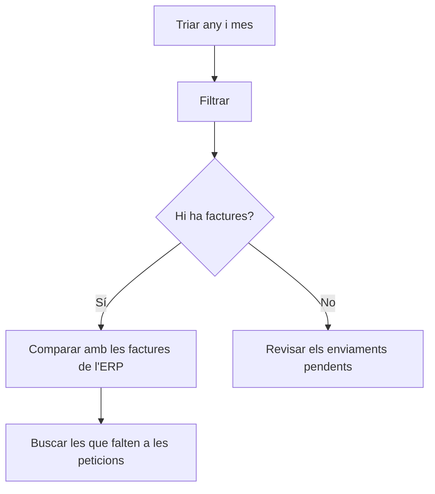

# Verifactu - Consulta de factures enviades

## Per a que serveix aquesta pantalla

Consulta directament a l'AEAT quines factures consten registrades a Verifactu en un mes concret. No mostra les dades de l'ERP, sinó el que l'AEAT té guardat. Serveix per contrastar els enviaments fets des de «Integració de Factures a Verifactu» i «Peticions d'integració Verifactu» amb el que realment consta a l'Agència Tributària.

## Accions disponibles

- Triar l'«Any» (des de 2024 fins a l'any actual) i el «Mes».
- Fer la consulta amb el botó «Filtrar» (icona de l'embut).
- Esborrar el filtre i buidar la llista amb «Netejar».
- Ordenar per qualsevol columna fent clic a la capçalera.
- Veure l'empremta completa passant el ratolí per sobre de la columna «Empremta».

## Flux habitual

1. Obre la pantalla: el filtre proposa el mes actual o l'últim mes que vas consultar.
2. Tria l'«Any» i el «Mes» que vols revisar.
3. Prem «Filtrar» i espera la resposta de l'AEAT.
4. Revisa la llista: número, data d'expedició, tipus, imports, data de registre i empremta.
5. Compara-la amb les factures del mes a l'ERP i, si en falta alguna, busca-la a «Peticions d'integració Verifactu».

## Aspectes importants

- La consulta no es fa sola en obrir la pantalla: cal prémer «Filtrar».
- La consulta es fa amb el «CIF» del centre actiu (pantalla «Gestió de centres») i el nom de l'empresa activa (pantalla «Gestió d'empreses»).
- Es busquen les factures amb data d'expedició dins del mes triat.
- La columna «Tipus» mostra el codi de l'AEAT: les factures ordinàries s'envien com a «F1» i les rectificatives com a «R1».
- La «Data de registre» és la data i hora en què l'ERP va generar el registre enviat.
- L'últim any i mes consultats es guarden com a filtre per a la propera vegada.
- Aquesta pantalla només consulta: no envia, no corregeix ni anul·la res.

## Errors frequents

- Si surt «Filtre incomplet», tria l'any i el mes abans de prémer «Filtrar».
- Si surt «Sense resultats», l'AEAT no té cap factura registrada per a aquell mes amb el CIF del centre. Comprova que les factures s'hagin enviat des de «Integració de Factures a Verifactu» i que el «CIF» del centre sigui correcte.
- Si surt «Error en la cerca de factures», la consulta a l'AEAT ha fallat. Torna-ho a provar més tard i, si persisteix, avisa l'administrador perquè revisi la connexió i el certificat de Verifactu.
- Si una factura enviada no apareix, busca-la a «Peticions d'integració Verifactu»: si la petició té «Error», l'AEAT no l'ha registrada i cal corregir-la i tornar-la a enviar.

## Proces basic

