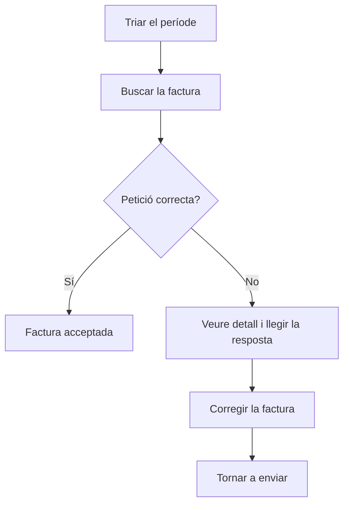

# Peticions d'integració Verifactu

## Per a que serveix aquesta pantalla

És l'historial de tots els enviaments de factures de venda a Verifactu. Cada vegada que s'envia una factura, correcta o no, queda una petició amb el que s'ha enviat a l'AEAT, el que ha respost i el codi QR. Serveix per comprovar si una factura consta com a acceptada, entendre per què s'ha rebutjat i tornar-la a enviar un cop corregida. Els enviaments es fan des de «Integració de Factures a Verifactu».

## Accions disponibles

- Triar el «Període» per veure les peticions fetes entre dues dates. La llista es recarrega sola quan les dues dates són vàlides.
- Filtrar per número de factura o per client amb «Cercar».
- Copiar la «Petició» o la «Resposta» completes amb el botó de copiar de cada cel·la.
- Obrir la pàgina de validació de l'AEAT fent clic a la imatge del «QR».
- Veure la petició i la resposta completes amb «Veure detall» (icona de l'ull).
- Tornar a enviar una factura rebutjada amb «Tornar a enviar» (icona de refresc), que només surt a les files amb error.
- Restablir els filtres amb «Netejar».

## Flux habitual

1. Obre la pantalla: surten les peticions dels últims set dies.
2. Busca la factura pel número o pel client.
3. Mira la columna «Èxit»: «Correcte» vol dir que l'AEAT l'ha acceptada; «Error», que l'ha rebutjada.
4. Si hi ha un error, obre «Veure detall» i llegeix la «Resposta» per saber el motiu.
5. Corregeix la factura (per exemple, les dades fiscals del client).
6. Torna aquí, prem «Tornar a enviar» a la fila amb error i confirma-ho amb «Acceptar».

## Aspectes importants

- Una factura pot tenir diverses peticions: una per cada intent. Surten totes les peticions de les factures que en tenen almenys una dins del període, encara que algun intent sigui d'abans.
- La columna «Estat» mostra l'estat que ha retornat l'AEAT: «Correcto», «AceptadoConErrores» o «Incorrecto». Els dos primers es consideren correctes.
- «Tornar a enviar» fa un enviament nou i afegeix una petició nova; no modifica les anteriors. La factura passa a l'estat de Verifactu «OK» o «Error» segons la resposta.
- Una factura que ja té alguna petició correcta no es pot tornar a enviar, encara que el botó surti en una fila d'error antiga d'aquella factura.
- El reenviament s'encadena amb l'últim registre acceptat, igual que un enviament normal des de «Integració de Factures a Verifactu».
- Aquesta pantalla no esborra ni anul·la res: només consulta i reenvia.
- El document de la factura imprimeix el QR de l'última petició correcta.

## Errors frequents

- Si en tornar a enviar surt «La factura ja ha estat integrada amb Verifactu», la factura ja té una petició correcta: busca-la a la llista, no cal fer res més.
- Si la «Resposta» indica un error en el NIF o el nom del client, corregeix-los a la pestanya «Dades fiscals» de la factura (només surt mentre l'estat de Verifactu és «Pendent» o «Error») i després torna a enviar.
- Si el reenviament torna a fallar amb el mateix motiu, llegeix el codi i la descripció del missatge d'error: venen directament de l'AEAT i indiquen quina dada cal corregir.
- Si no veus les peticions de l'últim dia del període, amplia la data final un dia més.
- Si la llista no es carrega, comprova que les dues dates del «Període» estiguin triades i que la inicial no sigui posterior a la final.
- Si la factura té resposta «AceptadoConErrores», consta com a acceptada: revisa la «Resposta» per veure els avisos de l'AEAT.

## Proces basic

