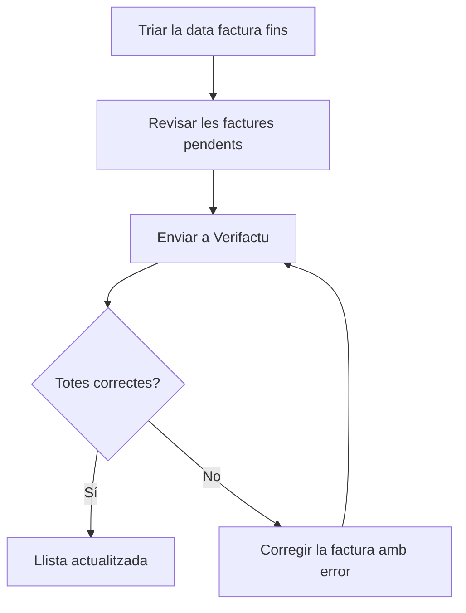

# Integració de Factures a Verifactu

## Per a que serveix aquesta pantalla

Des d'aquí s'envien a l'Agència Tributària (AEAT), a través de Verifactu, les factures de venda que encara no hi consten. És l'últim pas del circuit de venda: `comanda -> albarà -> factura -> enviament a Verifactu`. L'enviament no és automàtic: les factures no arriben a Verifactu fins que algú les envia des d'aquí o les torna a enviar des de «Peticions d'integració Verifactu».

## Accions disponibles

- Triar la «Data factura fins» per veure les factures pendents amb data de factura fins a aquell dia inclòs. La llista es recarrega sola en canviar la data.
- Restablir el filtre amb «Netejar»: la data torna a ser la d'avui.
- Enviar totes les factures de la llista amb «Enviar a Verifactu». El número del botó indica quantes factures s'enviaran.
- Obrir la fitxa d'una factura fent clic al seu número.
- Al diàleg de resultat, desplegar la resposta de l'AEAT d'una factura amb error amb «Mostrar detalls».

## Flux habitual

1. Obre la pantalla: surten les factures pendents fins a avui.
2. Si només vols enviar fins a una data concreta, canvia la «Data factura fins».
3. Revisa la llista (número, data, venciment, client amb el seu NIF i import).
4. Prem «Enviar a Verifactu» i espera que la barra de progrés acabi. Mentre s'envia, el diàleg no es pot tancar.
5. Revisa el resum de «correctes» i «errors» i tanca el diàleg amb «Tancar». La llista es recarrega i les factures acceptades desapareixen.
6. Si alguna factura ha fallat, corregeix-la (vegeu els errors més avall) i torna-la a enviar.

## Aspectes importants

- La llista mostra les factures amb l'estat de Verifactu inicial (normalment «Pendent») o «Error». Per això les factures rebutjades hi tornen a sortir per reintentar-les.
- Les factures reben l'estat inicial del cicle de vida «Verifactu» en crear-se, també les rectificatives. Les factures sense estat de Verifactu no surten mai en aquesta llista.
- Les factures s'envien una a una en ordre de número. Cada registre s'encadena amb l'últim registre acceptat per l'AEAT i porta una empremta (hash) calculada a partir de l'anterior; el primer registre de tots es marca com a inici de la cadena.
- L'enviament s'atura a la primera factura que falla, per mantenir la cadena en ordre. Les factures posteriors queden pendents i continuen a la llista.
- Una factura es considera acceptada quan l'AEAT respon «Correcto» o «AceptadoConErrores». En aquest cas l'estat de Verifactu de la factura passa a «OK»; si respon amb qualsevol altre estat, passa a «Error».
- Cada intent, correcte o no, queda registrat amb la petició enviada, la resposta i el codi QR. Es consulta a «Peticions d'integració Verifactu».
- Les factures rectificatives s'envien com a rectificatives i fan referència a la factura original.
- Quan una factura ja està acceptada, no es pot tornar a enviar i les seves dades fiscals de client queden bloquejades. El document de la factura imprimeix el QR de l'últim enviament acceptat.
- Com a emissor s'envien el «CIF» del centre de la factura i el nom de l'empresa (pantalles «Gestió de centres» i «Gestió d'empreses»).

## Errors frequents

- Si el resultat mostra «Incorrecto» i un missatge amb un codi i una descripció, és un rebuig de l'AEAT. Llegeix la descripció i, si cal, obre «Mostrar detalls» per veure la resposta completa.
- Si el rebuig és per les dades del client (NIF o raó social), obre la factura i corregeix-les a la pestanya «Dades fiscals», que només surt mentre l'estat de Verifactu és «Pendent» o «Error». En desar pots aplicar la correcció a les altres factures pendents o amb error del mateix client; la fitxa del client també s'actualitza. Després torna a enviar.
- Si surt «La factura no té detalls. No es pot enviar a Verifactu», afegeix línies a la factura abans d'enviar-la.
- Si surt «No s'ha trobat l'empresa per enviar la factura a Verifactu», comprova que hi hagi una empresa activa a «Gestió d'empreses».
- Si surt «La factura ja ha estat integrada amb Verifactu», la factura ja consta com a acceptada: comprova-ho a «Peticions d'integració Verifactu» i no la tornis a enviar.
- Si l'enviament s'atura per un error de temps d'espera o un error inesperat, abans de reintentar revisa «Peticions d'integració Verifactu»: la petició pot haver arribat igualment a l'AEAT. Si l'error es repeteix amb totes les factures, avisa l'administrador perquè revisi la connexió i el certificat de Verifactu.
- Si la llista surt sempre buida, comprova a «Cicles de vida» que existeixi el cicle «Verifactu» amb un estat inicial.
- Si una factura amb resposta «AceptadoConErrores» s'ha donat per bona, revisa'n la resposta a «Peticions d'integració Verifactu» per veure els avisos de l'AEAT.

## Proces basic

