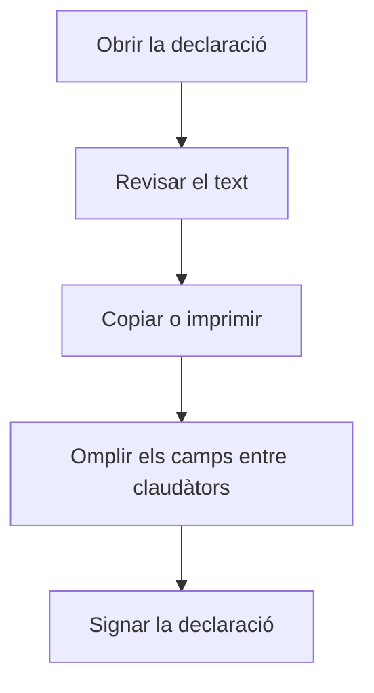

# Declaració responsable d'implementació del sistema Veri\*Factu

## Per a que serveix aquesta pantalla

Mostra el model de text de la declaració responsable sobre el sistema de facturació i Veri\*Factu. És un document de consulta: no es configura res, no es desa res i no s'envia res a l'AEAT. Serveix com a base per redactar la declaració que ha de signar l'empresa responsable del programari.

## Accions disponibles

- Llegir el text de la declaració.
- Imprimir-la des del navegador (per exemple, amb Ctrl+P): la pantalla té un format pensat per a la impressió.

## Flux habitual

1. Obre la pantalla.
2. Llegeix el text i identifica els camps entre claudàtors, per exemple [RAÓ SOCIAL], [CIF] o [Nom del software].
3. Copia el text al document on el vulguis completar.
4. Omple els camps entre claudàtors amb les dades reals i fes-lo signar a la persona responsable.

## Aspectes importants

- Els camps entre claudàtors són marcadors: l'aplicació no els omple amb les dades de l'empresa ni del centre.
- El text és fix i surt en l'idioma de l'aplicació. No es pot editar des d'aquí.
- La declaració enumera compromisos del programari (integritat dels registres, empremta i encadenament, enviament a l'AEAT, conservació i identificació única). La pantalla només els mostra; no fa cap comprovació.
- Els enviaments reals a Verifactu es fan a «Integració de Factures a Verifactu» i es consulten a «Peticions d'integració Verifactu».

## Errors frequents

- Si el document imprès surt amb [ciutat], [data] o [CIF] literals, és que no s'han omplert: la pantalla no substitueix aquests camps. Completa'ls en el document que signaràs.
- Si no trobes aquesta pantalla al menú, pot ser que no hi estigui afegida: un administrador la pot afegir al menú.
- Si necessites el text en un altre idioma, canvia l'idioma de l'aplicació i torna a obrir la pantalla.

## Proces basic

