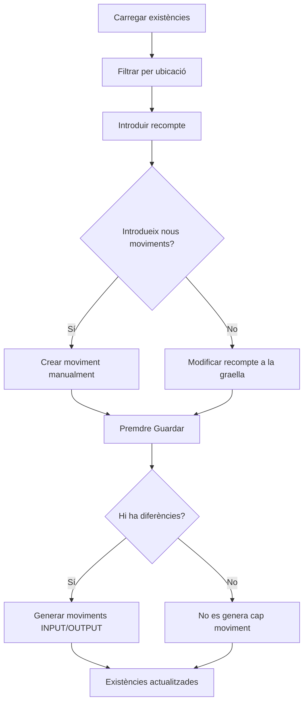

# Inventari

## Per a que serveix aquesta pantalla

La pantalla d'inventari permet fer el recompte física de les existències i registrar les diferències entre l'estoc registrat al sistema i el recompte real. Es carreguen totes les existències actuals i es permet modificar la quantitat (newQuantity) per generar els moviments d'ajust corresponents.

## Accions disponibles

- Carregar les existències actuals del sistema
- Filtrar per ubicació
- Cercar per nom de referència
- Modificar la quantitat de recompte (newQuantity) per a cada línia
- Crear un moviment de sortida o entrada segons la diferència amb l'estoc anterior
- Guardar els moviments d'inventari generats

## Flux habitual

1. Carrega les existències des del sistema (es fan automàticament en obrir).
2. Filtra per ubicació o cerca per referència si cal.
3. Revisa cada línia i introdueix el recompte real a la columna "Recompte".
4. Prem "Guardar" per generar els moviments d'inventari (entrades si hi ha excés, sortides si falta estoc).
5. El sistema crea automàticament els moviments d'ajust i actualitza les existències.

## Aspectes importants

- **Generació automàtica de moviments**: quan es guarda, el sistema compara `oldQuantity` (estoc registrat) amb `newQuantity` (recompte). Si son diferents, genera automàticament un moviment INPUT (si s'ha trobat més) o OUTPUT (si falta estoc) amb la descripció "Entrada per inventari" o "Sortida per inventari".
- Cal prémer "Guardar" per aplicar els canvis. No es generen moviments automàticament en introduir el recompte.
- Es poden crear nous moviments de tipus personalitzat des del botó de creació (després de filtrar o sense filtre).

## Errors frequents

- Si es guarda sense haver modificat cap quantitat, no es genera cap moviment.
- Si falta alguna referència a l'inventari, comprova que tingui existències al sistema abans d'obrir la pantalla.

## Proces basic

