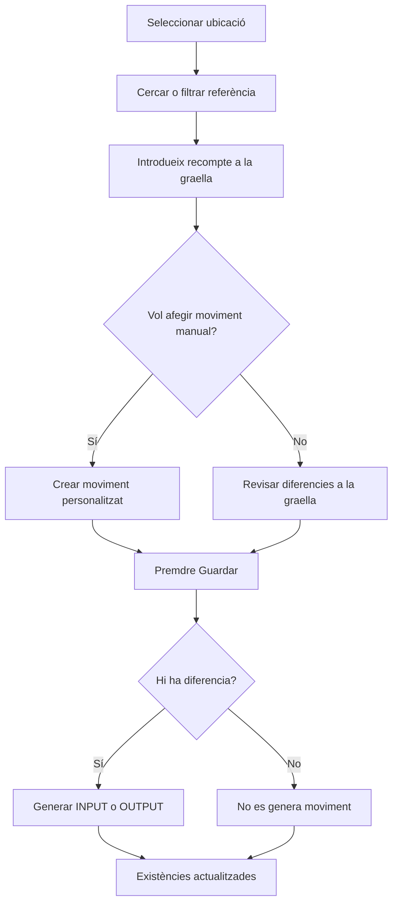

# Inventari

## Per a que serveix aquesta pantalla

La pantalla d'inventari permet gestionar les existències d'una ubicació de magatzem: afegir unitats, modificar el recompte o deixar a zero l'estoc d'una referència. Cada línia mostra el que hi ha registrat al sistema (`Uds.`) i permet introduir el recompte real (`Recompte`). Quan es guarda, el sistema genera automàticament els moviments d'estoc necessaris per ajustar l'estat real.

## Accions disponibles

- Carregar les existències actuals del sistema per a una ubicació
- Filtrar per ubicació de magatzem
- Cercar per nom de referència
- Modificar la quantitat de recompte (`Recompte`) per a cada línia de la graella
- Crear un moviment d'entrada (afegir existències)
- Crear un moviment de sortida (reduir o posar a zero existències)
- Posar totes les unitats a zero d'una referència (genera un moviment de sortida)
- Guardar tots els canvis (genera moviments INPUT/OUTPUT automàticament)

## Flux habitual

1. Selecciona la ubicació de magatzem per on vols fer el recompte.
2. Cerca o filtra la referència que vols inventariar.
3. Introdueix el recompte real a la columna `Recompte`:
   - **Més del que hi ha**: genera un moviment d'entrada (`INPUT`).
   - **Menos del que hi ha**: genera un moviment de sortida (`OUTPUT`).
   - **Zero**: genera un moviment de sortida per tota la quantitat (deixa l'estoc a zero).
4. Prem **Guardar** per generar i aplicar els moviments.

## Aspectes importants

- **Generació automàtica de moviments**: en prémer Guardar, el sistema compara `Uds.` (estoc registrat) amb `Recompte`. Per a cada diferència genera un `StockMovement` amb tipus `INPUT` o `OUTPUT` i la descripció "Entrada per inventari" o "Sortida per inventari".
- **No es generen moviments automàticament en introduir el recompte** — cal prémer Guardar per aplicar els canvis.
- **Tot en una mateixa ubicació**: tots els moviments generats s'assignen a la ubicació seleccionada.
- Es poden crear nous moviments de tipus personalitzat des del botó de creació (obre un formulari independent).

## Errors frequents

- Si es guarda sense haver modificat cap quantitat, no es genera cap moviment.
- Si es posa una referència a zero però no es prem Guardar, el canvi no es perd (roman a la graella) però no es tradueix en moviment.
- Si falta alguna referència, comprova que tingui existències a la ubicació seleccionada al sistema.

## Proces basic

