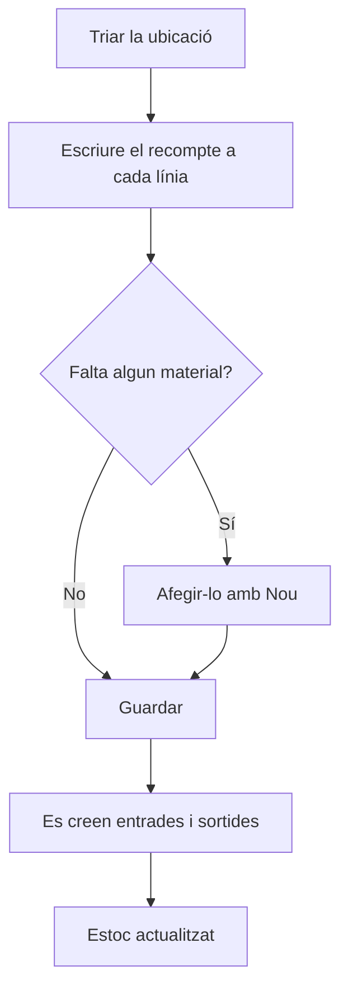

# Inventari

## Per a que serveix aquesta pantalla

Serveix per ajustar l'estoc del sistema al recompte físic. Cada línia mostra una referència en una ubicació, amb el seu lot i les seves mesures, les unitats que hi ha al sistema («Uds.») i una casella «Recompte» on escrius el que has comptat. En prémer «Guardar», el sistema crea una entrada o una sortida per cada diferència, que després es veuen a «Moviments de magatzem» i actualitzen «Estocs».

## Accions disponibles

- Filtrar per «Ubicació» i cercar per «Referència». La llista es filtra a l'instant.
- Treure els filtres amb «Netejar».
- Escriure el recompte real a la columna «Recompte» de cada línia.
- Afegir una línia d'estoc que no surt a la llista amb el botó «Nou» (+): tria el «Material», la «Ubicació», el lot, la «Quantitat» i, si cal, les mesures.
- Aplicar tots els canvis amb «Guardar».

## Flux habitual

1. Tria la «Ubicació» que vols comptar.
2. Per a cada línia, escriu el que has comptat a «Recompte». Deixa-la igual si coincideix.
3. Si trobes material que no surt a la llista, afegeix-lo amb «Nou» (+).
4. Prem «Guardar».
5. Comprova el missatge «Inventari creat correctament». La llista es torna a carregar amb l'estoc nou.

## Aspectes importants

- Fins que no prems «Guardar» no es desa res. Si surts de la pantalla abans, perds els recomptes escrits.
- «Guardar» aplica els canvis de totes les línies modificades, també les que el filtre amaga en aquell moment.
- Per a cada línia modificada: si el recompte és més alt que «Uds.», es crea una «Entrada» amb la descripció «Entrada per inventari»; si és més baix, una «Sortida» amb la descripció «Sortida per inventari». Un recompte de 0 buida la línia.
- El moviment es fa a la mateixa ubicació, lot i mesures de la línia.
- Les línies noves afegides amb «Nou» (+) surten amb «Uds.» a 0 i es desen com una entrada en prémer «Guardar». Si les mesures no coincideixen exactament amb les d'un estoc existent, es crea una línia d'estoc a part.
- Al diàleg «Nou», el lot només es pot triar després del material. Pots triar un lot obert o escriure un codi nou i triar l'opció «Crear lot "..."». El lot nou es crea en aquell moment, encara que després cancel·lis el diàleg.
- Si el recompte deixa un lot a zero a totes les ubicacions, el lot es tanca automàticament i ja no pot rebre més entrades.
- Només surten les línies amb unitats positives de magatzems, ubicacions i referències actius. Les referències de servei no tenen estoc.

## Errors frequents

- Si en desar surt «Error en crear el moviment d'inventari» amb «El lot ja està tancat i no es pot reobrir», la línia vol sumar unitats a un lot tancat: fes servir un lot obert o crea'n un de nou amb «Nou» (+).
- Si en desar surt «No hi ha una ubicació per defecte definida al projecte», tria la «Ubicació per defecte» del magatzem actiu a «Gestió de magatzems».
- Si en desar surt un error, torna a obrir la pantalla i revisa l'estoc abans de desar de nou: les línies que sí s'han desat ja s'han aplicat i es tornarien a aplicar.
- Si el diàleg «Nou» no es desa, revisa els avisos: «La referència és obligatòria», «La ubicació és obligatòria» o «La quantitat ha de ser com a mínim 1».
- Si no trobes una referència a la llista, comprova primer si té l'estoc a zero (afegeix-la amb «Nou» (+)) o si és en un magatzem o una ubicació desactivats.

## Proces basic

```mermaid
flowchart TD
    A[Triar la ubicació] --> B[Escriure el recompte a cada línia]
    B --> C{Falta algun material?}
    C -->|Sí| D[Afegir-lo amb Nou]
    C -->|No| E[Guardar]
    D --> E
    E --> F[Es creen entrades i sortides]
    F --> G[Estoc actualitzat]
```
