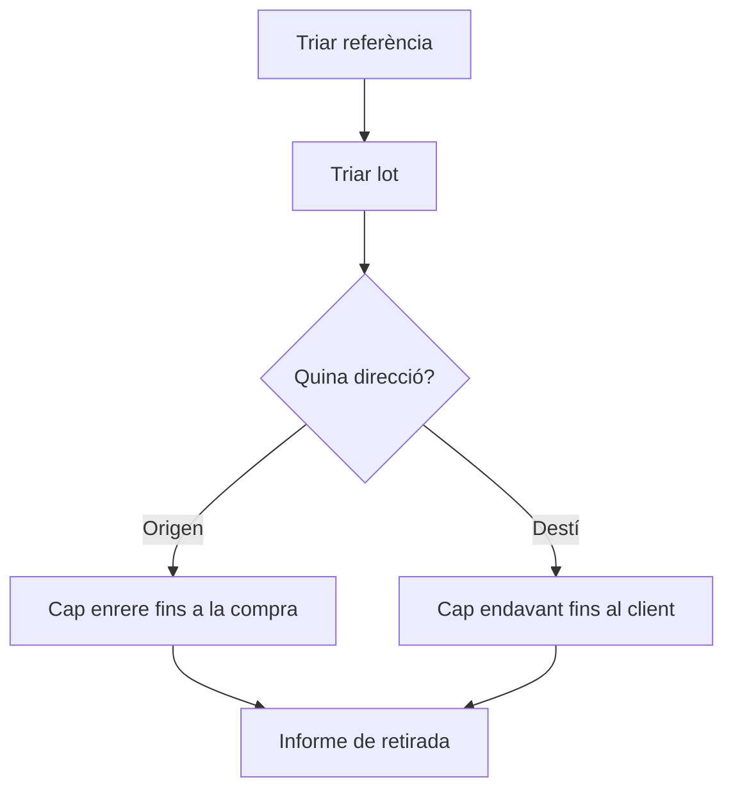

# Traçabilitat de lots

## Per a que serveix aquesta pantalla

Permet seguir un lot al llarg de la cadena `recepció de compra -> consum a la màquina -> producció de l'OF -> albarà de venda`. Tries una referència i un lot i veus, en forma d'arbre, de quins lots de material prové (cap enrere) o a quins lots produïts i clients ha arribat (cap endavant). En cas d'incidència de qualitat, l'«Informe de retirada» diu quins clients, albarans i unitats estan afectats. És una pantalla de consulta: no modifica res.

## Accions disponibles

- Triar la «Referència» i després el «Lot». La traçabilitat es carrega en triar el lot.
- Consultar la pestanya «Cap enrere (des d'un lot venut)»: els lots de material consumits per fabricar el lot, nivell a nivell, fins als lots que van entrar per una recepció de compra.
- Consultar la pestanya «Cap endavant (des d'un lot de compra)»: els lots produïts amb aquest material, nivell a nivell, fins al producte final.
- Desplegar cada lot de l'arbre amb la fletxa per veure'n els lots relacionats i els seus moviments.
- Generar l'«Informe de retirada» amb el botó del mateix nom. Surt a sota de les pestanyes.
- Arribar a la pantalla amb la referència i el lot ja triats des de la icona «Veure traçabilitat del lot» d'«Estocs», de «Moviments de magatzem» o de les línies d'un albarà de recepció.

## Flux habitual

1. Tria la «Referència» del producte o del material afectat.
2. Tria el «Lot» al desplegable.
3. A «Cap enrere», desplega l'arbre per veure de quins lots de material prové i, a les files de moviment, el proveïdor i l'albarà de recepció.
4. Canvia a «Cap endavant» per veure en quins lots produïts s'ha fet servir i, a les files de moviment, els clients i els albarans de venda.
5. Prem «Informe de retirada» per obtenir, per client, els albarans afectats, amb el total d'albarans i d'unitats.

## Aspectes importants

- Només tenen lots les referències marcades amb «Requereix lot». Els lots es creen sols: a la línia d'un albarà de recepció, en crear l'ordre de fabricació (el lot produït pren el codi de l'OF o el codi indicat en crear-la, segons la configuració), en un albarà de venda sense lot i al diàleg «Nou» d'«Inventari».
- L'enllaç entre un lot de material i el lot produït el crea el consum registrat en finalitzar la fase a la màquina. Sense aquest consum, l'arbre no pot baixar més.
- Cap enrere, l'arbre s'atura als lots que van entrar per una recepció de compra. L'arbre arriba com a màxim a 10 nivells.
- A la columna «Quantitat», la primera fila mostra el que queda del lot; les files d'altres lots, la quantitat consumida; i les files de moviment, la quantitat del moviment, negativa a les sortides i als consums.
- Les files de moviment porten l'etiqueta del tipus, la ubicació, el proveïdor o el client i la descripció. La «Data» només surt en aquestes files. Els trasllats d'aprovisionament a les màquines no hi surten.
- El desplegable «Lot» només ofereix lots oberts. Un lot es tanca sol quan el seu estoc arriba a zero a totes les ubicacions i no es torna a obrir, de manera que un lot ja consumit o venut del tot no es pot triar aquí.
- L'«Informe de retirada» parteix de la traçabilitat cap endavant: recull els albarans de venda dels lots finals als quals ha arribat el lot (o del mateix lot, si no s'ha fet servir per fabricar res), agrupats per client, amb «N albarans afectats» i «N unitats afectades». Si el lot s'ha consumit en alguna OF, l'informe no compta les vendes directes del mateix lot.

## Errors frequents

- Si el desplegable «Lot» surt desactivat, tria primer la «Referència».
- Si el lot que busques no surt al desplegable, comprova primer si ja està tancat (estoc a zero) o si la referència no té «Requereix lot».
- Si arribes des d'una icona de traçabilitat i el lot no queda triat, el lot ja està tancat.
- Si surt l'avís «No s'ha trobat el lot», el lot ja no existeix: torna a triar la referència.
- Si l'arbre cap enrere només mostra el lot triat, comprova que en finalitzar la fase de l'OF es registrés el consum del material i que aquest material tingués lot.
- Si l'informe diu «Aquest lot no ha arribat a cap client.», cap albarà de venda porta encara aquest lot ni els lots produïts a partir d'ell.

## Proces basic

