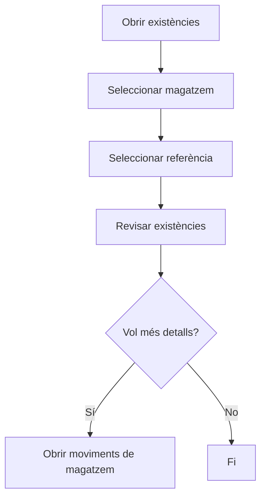

# Existències

## Per a que serveix aquesta pantalla

La pantalla d'existències mostra l'estoc actual de totes les referències emmagatzemades, desglossat per magatzem i ubicació. Permet consultar quantes unitats hi ha de cada referència, les seves dimensions i on estan ubicades.

## Accions disponibles

- Filtrar per magatzem
- Filtrar per referència
- Netejar els filtres actius
- Consultar les existències amb les seves dimensions (ample, llarg, alt, diàmetre, gruix)

## Flux habitual

1. Aplica els filtres de magatzem o referència per reduir el volum de resultats.
2. Revisa les existències amb les seves dimensions i ubicació.
3. Consulta les unitats totals de cada referència.

## Aspectes importants

- Les existències es mostren a nivell d'ubicació, no agregades per magatzem.
- El nombre d'unitats, les dimensions i la ubicació provenen del sistema de recepció i consum de materials.
- Si una referència no apareix, vol dir que no té existències en cap ubicació activa.

## Errors frequents

- Si no es mostra cap existència, comprova que hi hagi magatzems i ubicacions creades.
- Si falta una referència, verifica que hagi tingut alguna entrada d'estoc (recepció o moviment d'entrada).

## Proces basic

