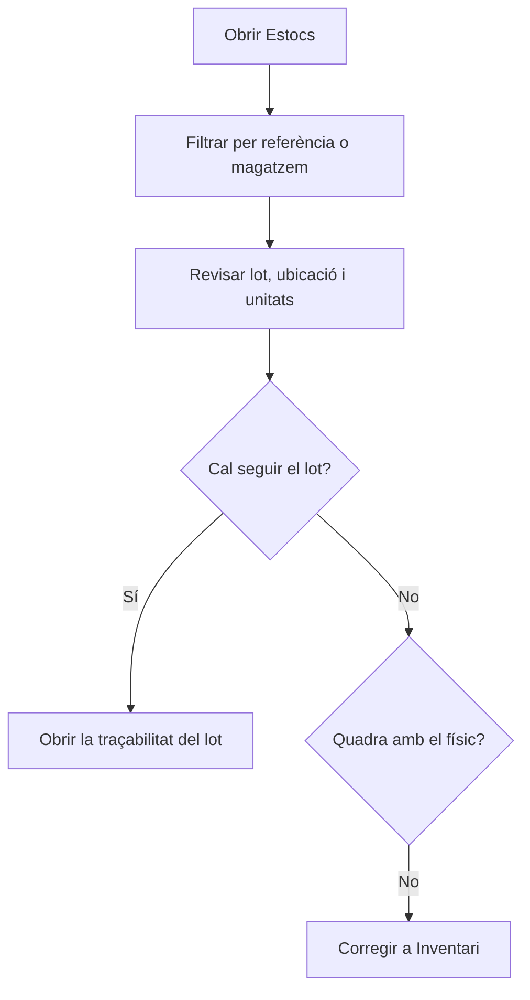

# Estocs

## Per a que serveix aquesta pantalla

Mostra l'estoc actual: quantes unitats hi ha de cada referència, en quin magatzem i ubicació, de quin lot i amb quines mesures. És una pantalla de consulta: l'estoc només canvia amb moviments, que generen les recepcions de compra, els albarans de venda, l'aprovisionament i el consum a les màquines, la producció de les ordres de fabricació i «Inventari». L'historial d'aquests moviments és a «Moviments de magatzem».

## Accions disponibles

- Filtrar per «Magatzem» i per «Referència». La llista es filtra a l'instant.
- Treure els filtres amb «Netejar».
- Ordenar per la columna «Referència».
- Obrir la traçabilitat del lot d'una fila amb la icona «Veure traçabilitat del lot». S'obre «Traçabilitat de lots» amb la referència i el lot ja triats.
- Desar la configuració de columnes i filtres en una vista, per recuperar-la el proper cop.

## Flux habitual

1. Obre «Estocs».
2. Tria la «Referència» que vols consultar i, si cal, el «Magatzem».
3. Revisa cada fila: «Lot», «Magatzem», «Ubicació», «Uds.» i mesures.
4. Si has de seguir un lot, prem la icona de traçabilitat de la fila.
5. Si l'estoc no quadra amb el físic, corregeix-lo a «Inventari».

## Aspectes importants

- Cada fila és una combinació de referència, ubicació, lot i mesures («Ample (x) mm», «Llarg (y) mm», «Alt (z) mm», «Diàmetre (mm)», «Gruix (mm)»). Una mateixa referència pot sortir en diverses files si té lots, ubicacions o mesures diferents.
- Només surten les files amb unitats positives. Quan una fila arriba a zero, desapareix.
- No surt l'estoc de magatzems, ubicacions o referències marcats com a desactivats.
- Les referències de servei mai tenen estoc.
- El desplegable «Referència» només ofereix referències que tenen estoc.
- L'etiqueta «Tancat» al costat del lot indica que el lot ja està tancat. Un lot es tanca sol quan el seu estoc total arriba a zero i ja no pot tornar a rebre entrades.
- La icona de traçabilitat queda desactivada si la fila no té lot.
- Les entrades automàtiques (recepcions, producció, retorns d'albarà) van a la «Ubicació per defecte» del magatzem actiu, definida a «Gestió de magatzems».

## Errors frequents

- Si una referència no surt, comprova primer que no sigui un servei, que no tingui l'estoc a zero i que el magatzem, la ubicació o la referència no estiguin desactivats.
- Si una recepció no s'ha sumat a l'estoc, comprova que l'albarà de recepció estigui a l'estat «Recepcionat»: fins llavors no genera l'entrada.
- Si l'estoc d'una referència surt repartit en files que esperaves juntes, revisa'n el lot i les mesures: qualsevol diferència crea una fila a part.
- Si la icona de traçabilitat obre la pantalla sense cap lot triat, el lot ja està tancat.

## Proces basic

```mermaid
flowchart TD
    A[Obrir Estocs] --> B[Filtrar per referència o magatzem]
    B --> C[Revisar lot, ubicació i unitats]
    C --> D{Cal seguir el lot?}
    D -->|Sí| E[Obrir la traçabilitat del lot]
    D -->|No| F{Quadra amb el físic?}
    F -->|No| G[Corregir a Inventari]
```
