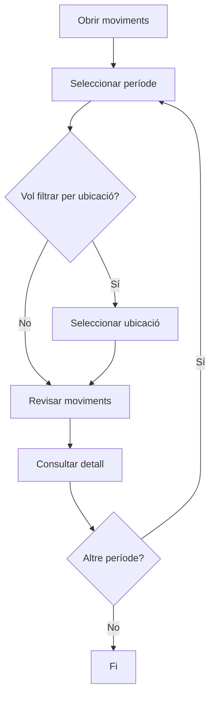

# Moviments de magatzem

## Per a que serveix aquesta pantalla

La pantalla de moviments de magatzem mostra l'historial complet de tots els moviments d'estoc: entrades, sortides, transfers i ajustos d'inventari. Cada moviment registra la data, la referència afectada, la ubicació, la quantitat i el tipus d'operació.

## Accions disponibles

- Filtrar per període de dates
- Filtrar per ubicació
- Netejar els filtres actius
- Consultar el detall de cada moviment (data, referència, tipus, quantitat)

## Flux habitual

1. Selecciona el període de dates que vols consultar (per defecte s'agafa l'exercici actual).
2. Opcionalment, filtra per una ubicació concreta.
3. Revisa la llista de moviments i el seu tipus (entrada, sortida, balanç).
4. Consulta els detalls de cada fila per veure'n la descripció i dimensions.

## Aspectes importants

- **Període obligatori**: cal seleccionar un rang de dates per carregar els moviments. Si el camp està buit, el sistema mostra un avís.
- Els moviments es carreguen a la data de l'exercici actual en obrir la pantalla.
- Cada moviment porta associat el tipus (INPUT, OUTPUT, BAL), la referència, la ubicació i la descripció de l'operació que el va generar.

## Errors frequents

- Si no es mostren moviments, comprova que el període seleccionat tingui moviments registrats.
- Si el filtre per ubicació no retorna res, verifica que existeixin moviments per a aquella ubicació.

## Proces basic

