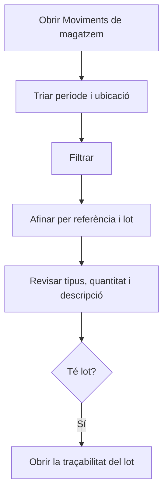

# Moviments de magatzem

## Per a que serveix aquesta pantalla

És l'historial de tots els moviments d'estoc: entrades i sortides, aprovisionament i consum a les màquines, producció i regularitzacions d'inventari. Serveix per saber per què l'estoc d'una referència o d'un lot és el que és. És només de consulta: els moviments els generen automàticament altres pantalles, i l'estoc resultant es veu a «Estocs».

## Accions disponibles

- Triar el «Període» i prémer «Filtrar» per carregar els moviments d'aquelles dates.
- Limitar la càrrega a una «Ubicació» (s'aplica en prémer «Filtrar»).
- Afinar la llista carregada per «Referència» i per «Lot».
- Treure els filtres amb «Netejar».
- Obrir la traçabilitat del lot d'un moviment amb la icona «Veure traçabilitat del lot».
- Desar la configuració de columnes i filtres en una vista, per recuperar-la el proper cop.

## Flux habitual

1. Obre «Moviments de magatzem». El «Període» ja proposa les dates de l'exercici de l'any en curs.
2. Ajusta el període i, si cal, la «Ubicació», i prem «Filtrar».
3. Tria la «Referència» i, si cal, el «Lot» per quedar-te només amb els moviments que t'interessen.
4. Revisa la «Data», el «Tipus de moviment», la «Quantitat» i la «Descripció», que indica d'on ve el moviment.
5. Si el moviment té lot, obre'n la traçabilitat amb la icona de la fila.

## Aspectes importants

- Què genera cada tipus de moviment:
  - «Entrada»: una recepció de compra quan l'albarà de recepció passa a l'estat «Recepcionat»; el retorn d'un albarà de venda que deixa d'estar «Entregat»; un recompte d'«Inventari» per sobre de l'estoc.
  - «Sortida»: un albarà de venda quan passa a «Entregat»; un recompte d'«Inventari» per sota de l'estoc.
  - «Entrada» i «Sortida» en parella: l'aprovisionament de material a una màquina i la seva devolució. La descripció diu, per exemple, «Aprovisionament a APR-... OF ...».
  - «Consum»: en finalitzar una fase a la màquina, es consumeix el material aprovisionat. Els retalls que sobren tornen a la ubicació per defecte com a «Consum» positiu («Retorn retall a ...»).
  - «Producció»: en finalitzar l'última fase d'una ordre de fabricació, entren a la ubicació per defecte les peces bones de l'última fase interna («Producció OF ...»).
- La «Quantitat» és positiva a les entrades i negativa a les sortides i als consums.
- Les referències de servei no generen mai moviments.
- Si un albarà de recepció deixa d'estar a «Recepcionat», el seu moviment d'entrada s'esborra de l'historial i l'estoc es resta. En canvi, si un albarà de venda deixa d'estar «Entregat», es crea un moviment d'entrada de retorn.
- La «Descripció» es desa en l'idioma de l'usuari que va generar el moviment.
- Els moviments no es poden modificar ni eliminar des d'aquí. Per corregir l'estoc, fes servir «Inventari».
- Els filtres «Referència» i «Lot» només actuen sobre els moviments ja carregats; el desplegable «Lot» només ofereix els lots que hi apareixen.

## Errors frequents

- Si surt l'avís «Filtre invàlid» amb «Selecciona un període», tria les dues dates del període abans de prémer «Filtrar».
- Si el «Període» surt buit en obrir la pantalla, no hi ha cap exercici amb el nom de l'any en curs: tria les dates a mà.
- Si no trobes un moviment, comprova primer que la seva data caigui dins del període i que la «Ubicació» filtrada sigui la correcta; després torna a prémer «Filtrar».
- Si falta l'entrada d'una recepció, comprova que l'albarà de recepció estigui a «Recepcionat» i que la referència no sigui un servei.
- Si la icona de traçabilitat no surt en un moviment, el moviment no té lot o el seu lot no té codi.

## Proces basic

```mermaid
flowchart TD
    A[Obrir Moviments de magatzem] --> B[Triar període i ubicació]
    B --> C[Filtrar]
    C --> D[Afinar per referència i lot]
    D --> E[Revisar tipus, quantitat i descripció]
    E --> F{Té lot?}
    F -->|Sí| G[Obrir la traçabilitat del lot]
```
