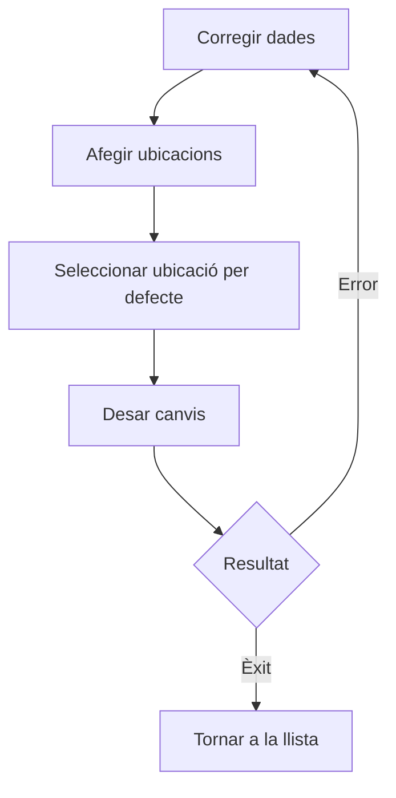

# Detall de magatzem

## Per a que serveix aquesta pantalla

Pantalla de gestió d'un magatzem concret. Permet editar les dades generals del magatzem (nom, descripció) i gestionar les seves ubicacions. Cada magatzem pot contenir múltiples ubicacions organitzades per tipus: subministrament, recepció, expedició o emmagatzematge.

## Accions disponibles

- Guardar els canvis de la fitxa del magatzem
- Crear una ubicació nova dins del magatzem
- Editar una ubicació existent
- Eliminar una ubicació
- Definir una ubicació per defecte per al magatzem

## Flux habitual

1. Omple o revisa les dades generals del magatzem (nom, descripció).
2. Afegeix les ubicacions necessàries segons els tipus d'operació.
3. Selecciona una ubicació per defecte abans de desar.
4. Desa els canvis.

## Aspectes importants

- **Ubicació per defecte obligatòria**: en mode edició, el sistema demana seleccionar una ubicació per defecte abans de desar. Si no n'hi ha cap, no es podrà desar.
- Les ubicacions eliminades que siguin la ubicació per defecte no es podran treure si són l'única referenciada.
- En crear un magatzem nou, les ubicacions s'afegeixen des de zero.

## Errors frequents

- Si no es pot desar, comprova que hi hagi una ubicació marcada com a per defecte.
- Si l'eliminació d'una ubicació mostra un avís d'ubicació amb dependències, aquella ubicació és la selecció per defecte del magatzem. Cal seleccionar-ne una altra primer.

## Proces basic

